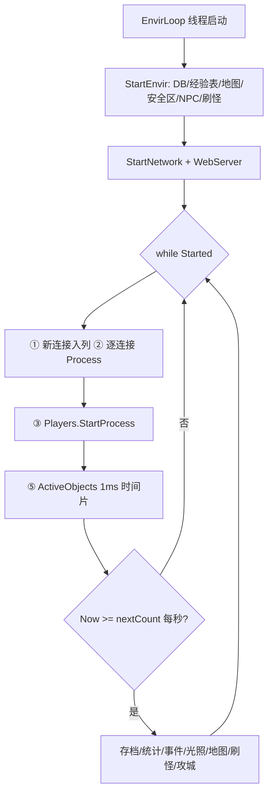

# 服务端环境与刷新机制（SEnvir 主循环 / 对象生命周期 / 地图加载 / NPC / 怪物刷新 / 事件调度）

## TL;DR 速查表

- 服务端全部游戏逻辑跑在一个后台线程 `SEnvir.EnvirThread` 的 `EnvirLoop()` 里（`ServerLibrary/Envir/SEnvir.cs:390-396`、`SEnvir.cs:1373`），**自由旋转循环（无 sleep、无固定 tick）**，每轮：收连接 → 收发包 → 玩家 StartProcess → **1ms 时间片**处理 ActiveObjects。
- 重活（DB 存档、地图 Process、实例卸载、刷怪 `spawn.DoSpawn`、攻城战、昼夜光照）集中在**每秒一次**的 `if (Now >= nextCount)` 块里（`SEnvir.cs:1480-1614`）。
- 全局时间不是 `DateTime.Now`，而是 `SEnvir.Now`，由 `LibraryCore/Time.cs:11` 的 Stopwatch 单调时钟每轮循环刷新一次。
- 所有地图对象在 `SEnvir.Objects`（LinkedList）里，只有附近有玩家的对象才进 `SEnvir.ActiveObjects` 被处理（Activate/DeActivate，`MapObject.cs:1005-1022`）。
- 对象下线统一走 `MapObject.Despawn()`（`MapObject.cs:1102-1128`）：清 Cell/Map 挂载 → 清可见列表 → 摘链 → CleanUp。
- 怪物刷新：每个 `RespawnInfo` 包装成运行时 `SpawnInfo`（`ServerLibrary/Models/Map.cs:374`），每秒 `DoSpawn` 补足到 `Count`；`Delay >= 1000000` 表示"每日定点刷新"，`Announce=true` 是 Boss 固定间隔 + 全服公告（`Map.cs:391-472`）。
- 地图二进制 `.map`：22 字节头 + 宽高 + 半分辨率背景层 + 每格 14 字节；服务端只解析格 flag（`Map.cs:58-90`），客户端解析全部渲染字段（`Client/Scenes/Views/MapControl.cs:484-547`）。格式细节见 `docs/MAP_FORMAT_COMPARISON.md`。
- NPC = `NPCInfo`（System.db，挂在 MapRegion 上）→ 开服 `CreateNPCs` 生成 `NPCObject` → 玩家点击 `C.NPCCall` → `NPCObject.NPCCall` 跑 `NPCPage` 页面链（Check → Action → Say/SuccessPage）。
- 事件系统：`EventInfoHandler` 反射扫描 `Envir/Events/` 下的 Trigger/Action 类，按 `"MONSTERDIE"`、`"TIMERMINUTE"` 等字符串触发（`EventInfoHandler.cs:32-75`）。
- Godot 客户端不移植服务端循环——单机模式直接拉起独立 ServerCore 进程（`GodotClient/Network/SinglePlayerLauncher.cs:27`）。

## 职责概述

`SEnvir`（Server Environment）是服务端的"世界容器 + 主循环"：负责加载数据库（System.db + Users.db）、加载/懒加载地图、创建安全区/NPC/刷怪点/任务区域、驱动网络收发与所有对象的处理、定时存档、昼夜光照计算、事件调度、实例（副本）生命周期与卸载。本文覆盖：启动流程、主循环各阶段顺序与时间片控制、MapObject 对象生命周期与延迟动作队列、地图文件加载（双侧）、NPC 系统、怪物刷新、事件调度，以及多实例并行下的对象隔离（实例系统细节另见 `map/instances.md`）。

## 关键类/文件清单

| 路径 | 行号 | 职责 |
|---|---|---|
| `ServerLibrary/Envir/SEnvir.cs` | 33-4571 | 全局环境：日志、网络监听、DB 集合、地图/实例字典、主循环、存档、昼夜、事件入口 |
| `ServerLibrary/Envir/SEnvir.cs` | 1373-1643 | `EnvirLoop()` 主循环本体 |
| `ServerLibrary/Envir/SEnvir.cs` | 731-774 | `StartEnvir()` 启动加载（DB/经验表/地图/NPC/刷怪） |
| `ServerLibrary/Envir/SEnvir.cs` | 436-571 | `LoadDatabase()` 打开 MirDB Session、取全部 DBCollection、建排行榜/BossList |
| `ServerLibrary/Envir/SEnvir.cs` | 4216-4238 | `FinaliseMapLoad()` 单张地图加载完成后的统一收尾 |
| `ServerLibrary/Envir/SEnvir.cs` | 4240-4286 | `GetMap()` 地获取（懒加载入口，含实例分支） |
| `ServerLibrary/Envir/SEnvir.cs` | 4296-4314 / 4316-4386 | `LoadInstance()` / `UnloadInstance()` 实例装/卸 |
| `ServerLibrary/Envir/Config.cs` | 8-185 | `Server.ini` 配置（MapPath:25、LazyLoadMaps:33、DBSaveDelay:37、MaxViewRange:96、DayCycleCount:107、DeadDuration:124 等） |
| `LibraryCore/Time.cs` | 6-12 | `Time.Now` 单调时钟（Stopwatch 基准） |
| `ServerLibrary/Models/MapObject.cs` | 16-1848 | 所有地图对象抽象基类：ObjectID/Node/Cell 挂载/可见性/激活/Despawn |
| `ServerLibrary/Models/DelayedAction.cs` | 5-39 | 延迟动作（Time/Type/Data）+ `ActionType` 枚举 |
| `ServerLibrary/Models/Map.cs` | 16-372 | `Map`：Cells 网格、Objects/Players/NPCs/Bosses 列表、广播 |
| `ServerLibrary/Models/Map.cs` | 374-473 | `SpawnInfo`：运行时刷怪点（NextSpawn/AliveCount/DoSpawn） |
| `ServerLibrary/Models/Map.cs` | 475-734 | `Cell`：格级对象列表、阻挡判定、`GetMovement` 走路触发（跳图/任务/事件） |
| `ServerLibrary/Models/MonsterObject.cs` | 928-954 / 2510-2547 | 怪 `Process()` 死亡计时 Despawn；`Die()` 扣 AliveCount + 触发 MONSTERDIE/MONSTERCLEAR |
| `ServerLibrary/Models/ItemObject.cs` | 23-31 / 189 | 掉落物过期 Despawn（`Config.DropDuration`） |
| `ServerLibrary/Models/NPCObject.cs` | 14-795 | NPC 对象：`NPCCall` 页面链、DoActions、CheckPage、可见性 |
| `ServerLibrary/Models/PlayerObject.cs` | 10159-10188 | 玩家侧 `NPCCall`/`NPCButton`（点击 NPC 入口） |
| `LibraryCore/SystemModels/MapInfo.cs`（本篇引用见下文） | — | 地图元数据（FileName 等），与 MapRegion/InstanceInfo 关联 |
| `LibraryCore/SystemModels/MapRegion.cs` | 9-220 | 区域：BitRegion/PointRegion、RegionType、CreatePoints/边缘点 |
| `LibraryCore/SystemModels/NPCInfo.cs` | 8-156 / 169-284 | `NPCInfo`（Region/NPCName/EntryPage）；`NPCPage`（对话页脚本数据） |
| `LibraryCore/SystemModels/RespawnInfo.cs` | 6-154 | 刷怪点持久化模型（Monster/Region/Delay/Count/Announce/RespawnIndex） |
| `LibraryCore/SystemModels/EventInfo.cs` | 8-61 / 219 / 505 | `WorldEventInfo`/`PlayerEventInfo`/`MonsterEventInfo`（计数器 + 动作阈值） |
| `ServerLibrary/Envir/Events/EventInfoHandler.cs` | 10-412 | 事件总线：反射注册 Trigger/Action、Process(string/player/monster) |
| `ServerLibrary/Envir/Events/Triggers/TimerMinute.cs` | 11-60 | `TIMERMINUTE` 触发器 + `EventTimer` 静态计时器列表 |
| `Client/Envir/Config.cs` | 39 | 客户端 `MapPath = ".\Map\"` |
| `Client/Scenes/Views/MapControl.cs` | 484-547 | 原版客户端 `.map` 完整解析（渲染字段） |
| `docs/MAP_FORMAT_COMPARISON.md` | 全文 | .map 格式逐字节布局（与 NAS 版对比） |

## 核心流程

### 1. 启动流程（SEnvir.StartServer → StartEnvir → StartNetwork）

入口 `StartServer()` 只做一件事：起后台线程跑 `EnvirLoop`（`SEnvir.cs:390-396`）：

```csharp
public static void StartServer()
{
    if (Started || EnvirThread != null) return;

    EnvirThread = new Thread(() => EnvirLoop()) { IsBackground = true };
    EnvirThread.Start();
}
```

`EnvirLoop()` 开头先做初始化（`SEnvir.cs:1373-1395`）：

```csharp
public static void EnvirLoop()
{
    Now = Time.Now;
    DateTime DBTime = Now + Config.DBSaveDelay;

    StartEnvir();
    StartNetwork();

    WebServer.StartWebServer();

    Started = NetworkStarted;
    ...
    Log($"Loading Time: {Functions.ToString(Time.Now - Now, true)}");
```

`StartEnvir()`（`SEnvir.cs:731-774`）的加载顺序：

1. **`LoadDatabase()`**（`SEnvir.cs:436-571`）：
   - `Session = new Session(SessionMode.Users) { BackUpDelay = 60 }`，`Session.Initialize(LibraryCore程序集, ServerLibrary程序集)`（440-448）——System.db + Users.db 的全部表按程序集扫描注册；
   - 依次 `Session.GetCollection<T>()` 填充 70+ 个静态 `DBCollection` 字段（450-517），如 `MapInfoList`、`RespawnInfoList`、`NPCInfoList`、`AccountInfoList`…；
   - 解析全局单例物品（GoldInfo=金币 DropItem、RefinementStone 等，519-527）、`MysteryShipMapRegion`/`LairMapRegion`（529-530）、StarterGuild 兜底创建（531-539）；
   - 重建排行榜 `Rankings`（LinkedList，542-551）；
   - 清理悬空 UserQuest/UserQuestTask（554-560）；
   - 组 `BossList`（`monster.IsBoss && Drops.Count > 0`，562-568）；
   - `CreateMagic()` 反射收集全部 `MagicObject` 子类（570、1244-1255）。
2. **`LoadExperienceList()`**：读 `./Config/ExperienceList.txt`（398-434）。
3. 为每个 `InstanceInfo` 预建实例槽位数组 `Instances[info] = new Dictionary<MapInfo, Map>[MaxInstances>0 ? MaxInstances : 255]`（736-741）。
4. **地图加载二选一**：
   - `Config.LazyLoadMaps == false`（默认 true，`Config.cs:33`）：全量 `new Map(...)` → `Parallel.ForEach(Maps, x => x.Value.Load())` 并行读文件 → 各 Region `CreatePoints(map.Width)` → `map.Setup()` → `CreateSafeZones/CreateMovements/CreateNPCs/CreateSpawns/CreateQuestRegions`（743-769）。
   - 懒加载（默认）：只调 `CreateStartZones()`（770-773），即仅对 `StartClass != None || RedZone` 的安全区 `GetMap(info.Region.Map)` 触发出生点地图加载（1183-1191）。其余地图在运行期第一次被 `GetMap` 命中时按需加载（见第 6 节）。

`StartNetwork()`（`SEnvir.cs:84-106`）起两个 `TcpListener`：游戏端口 `Config.Port`（默认 7000）和在线人数端口 `Config.UserCountPort`（默认 3000），`BeginAcceptTcpClient` 异步接连接；新连接进 `ConcurrentQueue<SConnection> NewConnections`（79-80、88-96、156-159），待主循环取走。`Connection` 回调里有 IP 封禁检查和背压（`NewConnections >= 15` 时 `Thread.Sleep(1)`，154-173）。

### 2. 主循环 EnvirLoop（骨架照抄）

`SEnvir.cs:1397-1631`，每轮迭代顺序（照抄，注释为本文所加）：

```csharp
while (Started)                                  // SEnvir.cs:1397  自由旋转，无 sleep
{
    Now = Time.Now;                              // 1399  每轮刷新全局时钟
    loopCount++;

    try
    {
        SConnection connection;
        while (!NewConnections.IsEmpty)          // 1405-1414 ① 接入新连接（IP 计数）
        {
            if (!NewConnections.TryDequeue(out connection)) break;
            IPCount.TryGetValue(connection.IPAddress, out var ipCount);
            IPCount[connection.IPAddress] = ipCount + 1;
            Connections.Add(connection);
        }

        long bytesSent = 0;
        long bytesReceived = 0;

        for (int i = Connections.Count - 1; i >= 0; i--)   // 1419-1428 ② 逐连接收发包
        {
            if (i >= Connections.Count) break;
            connection = Connections[i];
            connection.Process();
            bytesSent += connection.TotalBytesSent;
            bytesReceived += connection.TotalBytesReceived;
        }

        long delay = (Time.Now - Now).Ticks / TimeSpan.TicksPerMillisecond;  // 1430 网络耗时统计
        if (delay > conDelay)
            conDelay = delay;

        for (int i = Players.Count - 1; i >= 0; i--)       // 1434-1435 ③ 所有在线玩家（每轮必跑）
            Players[i].StartProcess();

        TotalBytesSent = DBytesSent + bytesSent;           // 1437-1438 流量统计
        TotalBytesReceived = DBytesReceived + bytesReceived;

        if (ServerBuffChanged)                             // 1440-1446 ④ 全服 buff 变更广播
        {
            for (int i = Players.Count - 1; i >= 0; i--)
                Players[i].ApplyServerBuff();
            ServerBuffChanged = false;
        }

        DateTime loopTime = Time.Now.AddMilliseconds(1);   // 1448 ⑤ 1ms 时间片处理 ActiveObjects

        if (lastindex < 0) lastindex = ActiveObjects.Count; // 1450 游标回卷

        while (Time.Now <= loopTime)                        // 1452-1478 时间片内尽量多处理
        {
            lastindex--;
            if (lastindex >= ActiveObjects.Count) continue;
            if (lastindex < 0) break;

            MapObject ob = ActiveObjects[lastindex];
            if (ob.Race == ObjectType.Player) continue;     // 玩家已在 ③ 处理

            try
            {
                ob.StartProcess();                          // 非玩家对象的全部逻辑
                count++;
            }
            catch (Exception ex)
            {
                ActiveObjects.Remove(ob);                   // 单对象异常不拖垮主循环
                ob.Activated = false;
                Log(ex.Message);
                Log(ex.StackTrace);
                File.AppendAllText(@"./Errors.txt", ex.StackTrace + Environment.NewLine);
            }
        }

        if (Now >= nextCount)                               // 1480 ⑥ 每秒一次的重活阶段
        {
            if (Now >= DBTime && !Saving)                   // 1482-1490 ⑦ 定时存档
            {
                DBTime = Time.Now + Config.DBSaveDelay;
                saveTime = Time.Now;
                Save();
                SaveDelay = (Time.Now - saveTime).Ticks / TimeSpan.TicksPerMillisecond;
            }

            ProcessObjectCount = count;                     // 1492-1504 运行统计/带宽
            LoopCount = loopCount;
            ConDelay = conDelay;
            ...
            if (Now >= UserCountTime)                       // 1506-1525 ⑧ 每 5 分钟播报在线数
            { ... }

            if (Now >= EventTimerTime)                      // 1527-1537 ⑨ 每 1 分钟跑 TIMERMINUTE 事件
            {
                EventTimerTime = Now.AddMinutes(1);
                foreach (var timer in EventTimer.Timers)
                {
                    if (!timer.Started) continue;
                    EventHandler.Process(timer.Player, "TIMERMINUTE");
                }
            }

            CalculateLights();                              // 1539 ⑩ 昼夜/光照

            CheckGuildWars();                               // 1541

            foreach (KeyValuePair<MapInfo, Map> pair in Maps)
                pair.Value.Process();                       // 1543-1544 ⑪ 主世界地图 Process

            foreach (var instance in Instances)             // 1546-1570 ⑫ 实例地图 Process + 过期卸载
            {
                for (byte instanceSequence = 0; instanceSequence < instance.Value.Length; instanceSequence++)
                {
                    bool expired = false;
                    if (instance.Value[instanceSequence] == null) continue;

                    foreach (KeyValuePair<MapInfo, Map> pair in instance.Value[instanceSequence])
                    {
                        pair.Value.Process();
                        if (pair.Value.InstanceExpiry != DateTime.MinValue && pair.Value.InstanceExpiry < Now)
                            expired = true;
                    }

                    if (expired || instance.Value[instanceSequence].Values.All(x => x.LastPlayer.AddMinutes(Globals.InstanceUnloadTimeInMinutes) < DateTime.UtcNow))
                    {
                        UnloadInstance(instance.Key, instanceSequence);
                        break;
                    }
                }
            }

            foreach (SpawnInfo spawn in Spawns)             // 1572-1573 ⑬ 刷怪
                spawn.DoSpawn(false);

            for (int i = ConquestWars.Count - 1; i >= 0; i--) // 1575-1576 ⑭ 攻城战
                ConquestWars[i].Process();

            if (Config.EnableWebServer)                      // 1578-1584 ⑮ Web 命令/充值
                WebServer.Process();
            if (Config.ProcessGameGold)
                ProcessGameGold();

            nextCount = Now.AddSeconds(1);                   // 1586 下一次 1 秒相位

            if (nextCount.Day != Now.Day)                    // 1588-1605 ⑯ 跨天：行会日贡献清零 + GC
            { ... GC.Collect(2, GCCollectionMode.Forced); }

            foreach (CastleInfo info in CastleInfoList.Binding) // 1607-1613 ⑰ 到点自动攻城
            {
                if (nextCount.TimeOfDay < info.StartTime) continue;
                if (Now.TimeOfDay > info.StartTime) continue;
                StartConquest(info, false);
            }
        }
    }
    catch (Exception ex)                                     // 1616-1630 主循环级异常 → 关服
    {
        Session = null;
        Log(ex.Message);
        Log(ex.StackTrace);
        File.AppendAllText(@"./Errors.txt", ex.StackTrace + Environment.NewLine);

        Packet p = new G.Disconnect { Reason = DisconnectReason.Crashed };
        for (int i = Connections.Count - 1; i >= 0; i--)
            Connections[i].SendDisconnect(p);

        Thread.Sleep(3000);
        break;
    }
}
```

循环退出后的关服序列（`SEnvir.cs:1633-1642`）：`StopWebServer()` → `StopNetwork()`（给所有连接发 `Disconnect(ServerClosing)`，`SEnvir.cs:107-142`）→ 等 `Saving` 结束 → `Session.BackUpDelay = 0` → 最后一次 `Save()` → `StopEnvir()`（1257-1371：全部集合/字典置 null、`GC.Collect` 压缩 LOH）。

阶段顺序总结（每轮）：**Network(新连接→逐连接 Process) → Players → ServerBuff → ActiveObjects(1ms 片)**；每秒相位内：**Save → 统计 → 在线播报 → TIMERMINUTE → CalculateLights → GuildWars → Maps.Process → 实例 Process/卸载 → Spawns.DoSpawn → ConquestWars → Web/GameGold → 跨天/攻城检查**。



### 3. tick 频率与时间片控制

- **没有固定 tick**：`while (Started)` 是忙循环（`SEnvir.cs:1397`），循环体里唯一的"节流"是对象处理时间片 `DateTime loopTime = Time.Now.AddMilliseconds(1)`（1448）——即每轮最多花 ~1ms 处理 ActiveObjects，剩下的轮次预算全给网络与玩家。
- **游标续跑**：`lastindex` 是跨轮持久的游标（1388 声明，1450 回卷），从 `ActiveObjects` 尾部往前处理，处理不完的留到下一轮继续，保证大服不卡死网络相位。
- **1 秒相位**：`nextCount = Now.AddSeconds(1)`（1586），`LoopCount`/`ProcessObjectCount`/`ConDelay` 每秒重置（1492-1498），即主循环每秒空转次数与每秒处理对象数是运维观测指标。
- **时钟源**：`SEnvir.Now` 每轮循环开头刷新（1399），底层 `LibraryCore/Time.cs:11`：`public static DateTime Now => StartTime + Stopwatch.Elapsed;`——**单调递增**，不受系统改时间影响；所有游戏计时（Buff/CD/刷新）一律比较 `SEnvir.Now`，绝不直接用 `DateTime.Now`（个别处如 `LastPlayer` 卸载判断用 `DateTime.UtcNow`，`SEnvir.cs:1564`）。
- **存档节拍**：`DBTime = Now + Config.DBSaveDelay`（1376，默认 5 分钟，`Config.cs:37`）；到期且 `!Saving` 时 `Save()`（1482-1490）。`Save()` 把 `Session.Save(false)` 放前台、`CommitChanges` 放后台线程并置 `Saving=false`（`SEnvir.cs:1794-1814`）。
- **日志线程**：另起 `WriteLogsLoop` 后台线程，每 10 秒刷一次盘（1390-1391、1815-1831）。

### 4. 对象生命周期（MapObject）

#### 4.1 身份与挂载

```csharp
public uint ObjectID { get; }                     // MapObject.cs:18  构造时取 SEnvir.ObjectID
public LinkedListNode<MapObject> Node;           // MapObject.cs:19  在 SEnvir.Objects 链表中的节点
...
public bool Spawned, Dead, CoolEye, Activated;   // MapObject.cs:78
```

- `ObjectID` 来自 `SEnvir.ObjectID => (uint)Interlocked.Increment(ref _ObjectID)`（`SEnvir.cs:330-331`），进程内唯一、复用不回收。
- `CurrentCell`/`CurrentMap` 是带副作用的属性：赋值即触发 `LocationChanged`/`MapChanged`，完成 Cell/Map 列表迁移（34-63）。
- 全局容器：`SEnvir.Objects`（LinkedList，**所有已生成对象**）、`SEnvir.ActiveObjects`（**仅激活对象**）、`SEnvir.Players`（334-336）；地图侧 `Map.Objects/Players/Bosses/NPCs` 与 `Cell.Objects`、`Map.OrderedObjects[x]`（按 X 列的 HashSet，用于范围查询）。

#### 4.2 Spawn（上线/出生）

`MapObject.Spawn` 三个重载（`MapObject.cs:789-861`）：`Spawn(MapRegion, instance, seq)` 在区域内随机取点（最多试 20 次，799-800）→ `Spawn(MapInfo,...)` → 核心 `Spawn(Map map, Point location)`：

```csharp
public bool Spawn(Map map, Point location)
{
    if (Node != null)
        throw new InvalidOperationException("Node is not null, Object already spawned");  // 819-820 防重复生成

    if (map == null || map.Info == null) return false;

    if (Race == ObjectType.Player && map.Info.MinimumLevel > Level && ...) return false;   // 824-847 玩家侧地图准入（等级/职业，TempAdmin 豁免）
    ...
    Cell cell = map.GetCell(location);
    if (cell == null) return false;

    CurrentCell = cell;                 // 853  → LocationChanged → cell.AddObject(this)
                                        //        → Cell.AddObject 内 ob.CurrentMap = Map（Map.cs:513）
                                        //        → MapChanged → map.AddObject(this)（MapObject.cs:862-868）
    Spawned = true;
    Node = SEnvir.Objects.AddLast(this); // 856  挂全局链表

    OnSpawned();                         // 858  基类只记 SpawnTime = SEnvir.Now（911-914）
    return true;
}
```

`Map.AddObject` 按 Race 分拣进 `Players`/`NPCs`/`Bosses`（IsBoss 怪）等列表（`Map.cs:225-247`）；`Cell.AddObject` 同时把对象加进 `Map.OrderedObjects[Location.X]`（`Map.cs:506-517`）。子类（如 `MonsterObject`/`NPCObject`）重写 `OnSpawned` 调 `AddAllObjects()`，把自己推给视野内玩家（`MapObject.cs:965-981`）。

#### 4.3 激活机制（ActiveObjects）

```csharp
public virtual void Activate()          // MapObject.cs:1005-1013
{
    if (Activated) return;
    if (NearByPlayers.Count == 0) return;   // 身边没玩家 → 不激活（休眠省 CPU）

    Activated = true;
    SEnvir.ActiveObjects.Add(this);
}
public virtual void DeActivate()        // MapObject.cs:1014-1022
{
    if (!Activated) return;
    if (NearByPlayers.Count > 0 && ActionList.Count == 0) return;  // 有玩家围观或还有延迟动作 → 保持激活

    Activated = false;
    SEnvir.ActiveObjects.Remove(this);
}
```

`NearByPlayers` 由玩家移动/可见性刷新维护（同图且 `Functions.InRange(..., Config.MaxViewRange)`，`MapObject.cs:1095-1100`）。玩家对象不走 ActiveObjects——主循环每轮直接遍历 `SEnvir.Players`（`SEnvir.cs:1434-1435`），且时间片里 `if (ob.Race == ObjectType.Player) continue`（1462）。

`StartProcess()` 是每个激活对象的"每轮入口"（`MapObject.cs:128-154`）：

```csharp
public void StartProcess()
{
    DeActivate();

    //Other things
    for (int i = ActionList.Count - 1; i >= 0; i--)   // 133-140 ① 到期的 DelayedAction
    {
        if (SEnvir.Now < ActionList[i].Time) continue;

        DelayedAction ac = ActionList[i];
        ActionList.RemoveAt(i);
        ProcessAction(ac);
    }

    ProcessBuff();      // 142 ② buff 计时
    ProcessPoison();    // 143 ③ 毒素计时
    Process();          // 144 ④ 子类逻辑（怪物 AI 在 MonsterObject.Process）

    ProcessHPMP();      // 146 ⑤ 血蓝显示节流

    Color oldColour = NameColour;
    ProcessNameColour(); // 148-152 ⑥ 名字颜色变化广播
    if (oldColour != NameColour)
        Broadcast(new S.ObjectNameColour { ObjectID = ObjectID, Colour = NameColour });
}
```

#### 4.4 Despawn / Remove 时机

统一出口 `MapObject.Despawn()`（`MapObject.cs:1102-1128`）：

```csharp
public void Despawn()
{
    if (Node == null)
        throw new InvalidOperationException("Node is null, Object already Despawned");

    OnBeforeDespawned();        // 子类钩子（掉落归属清理等）

    CurrentMap = null;          // → MapChanged → map.RemoveObject(this)（Map 列表摘除）
    CurrentCell = null;         // → LocationChanged → cell.RemoveObject(this)（Cell/OrderedObjects 摘除）

    RemoveAllObjects();         // 让所有还"看得见"自己的玩家移除自己（发 ObjectRemove）

    Node.List.Remove(Node);     // 摘全局链表 SEnvir.Objects
    Node = null;

    if (Activated)
    {
        Activated = false;
        SEnvir.ActiveObjects.Remove(this);
    }

    OnDespawned();              // 递归 Despawn 自己的 SpellList（1154-1158）
    CleanUp();                  // 清空 ActionList/Buffs/NearByPlayers 等全部列表（1130-1147）
}
```

各对象类型的 Despawn 时机（均实测）：

| 对象 | 触发点 | 代码 |
|---|---|---|
| 怪物死亡 | `Die()` 设 `DeadTime = Now + Config.DeadDuration`（+可采集 `HarvestDuration`），`Process()` 里 `if (SEnvir.Now > DeadTime) Despawn()` | `MonsterObject.cs:2527-2530`、`MonsterObject.cs:932-941` |
| 掉落物 | `ExpireTime = Now + Config.DropDuration`（默认 60 分钟），`Process()` 到期 Despawn；被拾取也 Despawn | `ItemObject.cs:189`、`ItemObject.cs:27-31`、`ItemObject.cs:103/135` |
| 玩家下线 | 登出流程先 Despawn 宠物/法术场，再 `Despawn()`，最后 `OnDespawned → SEnvir.Players.Remove(this)` | `PlayerObject.cs:1013-1030`、`PlayerObject.cs:1542-1547` |
| NPC/守卫/城堡件 | 一般常驻；实例卸载时随地图丢弃（实例字典置 null） | `SEnvir.cs:4316-4351` |
| 特殊怪 | 镜像/傀儡/石门等自毁（`MirrorImage.cs:32-35`、`Puppet.cs:27-30`、`JinamStoneGate.cs:50-52` 等） | `ServerLibrary/Models/Monsters/` |

注意：对象被 `Despawn` 后**不回收 ObjectID**；怪物的 `SpawnInfo` 计数在 `Die()` 里就先行扣减并把 `SpawnInfo` 置 null（`MonsterObject.cs:2534-2544`），尸体 Despawn 只是清场。

#### 4.5 DelayedAction 延迟动作队列

`ServerLibrary/Models/DelayedAction.cs:5-39` 全文结构：

```csharp
public sealed class DelayedAction
{
    public DateTime Time;
    public ActionType Type;
    public object[] Data;

    public DelayedAction(DateTime time, ActionType type, params object[] data)
    {
        Time = time;
        Type = type;
        Data = data;
    }
}

public enum ActionType
{
    Turn, Move, Mount, Harvest, Mining, Fishing, Taming, Attack, Magic, RangeAttack,
    DelayAttack, DelayMagic, BroadCastPacket, Function,
    DelayedAttackDamage, DelayedMagicDamage
}
```

- 每对象一个 `List<DelayedAction> ActionList`（`MapObject.cs:84`，构造时创建 122）。用法是 `ActionList.Add(new DelayedAction(SEnvir.Now.AddMilliseconds(x), ActionType.YYY, args...))`。
- 消费在 `StartProcess()` 开头倒序扫描（`MapObject.cs:133-140`），到期一个摘一个交给 `ProcessAction(ac)`；基类只处理 `BroadCastPacket`（779-787），玩家/怪物子类重写处理 `Attack/Magic/DelayAttack` 等战斗延迟（如 `MonsterObject.cs:900-927`）。
- 队列非空会阻止对象休眠（`DeActivate` 里 `ActionList.Count == 0` 条件，`MapObject.cs:1018`）——**延迟动作是保活条件之一**。

### 5. 地图加载（服务端 + 客户端两侧）

#### 5.1 服务端 Map.Load（只读格 flag）

`ServerLibrary/Models/Map.cs:58-90`：

```csharp
public void Load()
{
    var path = Path.Combine(Config.MapPath, Info.FileName + ".map");   // Config.MapPath 默认 "Debug/ServerCore/Map/"（Config.cs:25）

    if (!File.Exists(path))
    {
        SEnvir.Log($"Map: {path} not found.");
        return;
    }

    byte[] fileBytes = File.ReadAllBytes(path);

    Width = fileBytes[23] << 8 | fileBytes[22];     // 小端 Int16
    Height = fileBytes[25] << 8 | fileBytes[24];

    Cells = new Cell[Width, Height];

    int offSet = 28 + Width * Height / 4 * 3;       // 28 字节头 + 半分辨率背景层(W/2*H/2*3B)

    for (int x = 0; x < Width; x++)
        for (int y = 0; y < Height; y++)
        {
            byte flag = fileBytes[offSet + (x * Height + y) * 14];   // 每格 14 字节，取第 0 字节

            if ((flag & 0x02) != 2 || (flag & 0x01) != 1) continue;   // 位 0x02|0x01 都置位才算可走格

            ValidCells.Add(Cells[x, y] = new Cell(new Point(x, y)) { Map = this });
        }

    OrderedObjects = new HashSet<MapObject>[Width];
    for (int i = 0; i < OrderedObjects.Length; i++)
        OrderedObjects[i] = new HashSet<MapObject>();
}
```

服务端**不解析渲染字段**（动画帧/贴图索引/光照字节），只留 `Cell` 引用（可走格）与 `ValidCells`（随机取点用）。格式逐字节细节见 `docs/MAP_FORMAT_COMPARISON.md:22-44`（22 字节头 + 偏移 22-23 宽、24-25 高、28 起背景层、每格 14 字节布局）。

加载完成后的 `Setup()`（`Map.cs:91-102`）生成守卫、城堡旗/门/守卫，`CreateCellRegions()` 把 `RegionType.Area` 的区域点写进 `Cell.Regions`（186-207）。

#### 5.2 懒加载与 FinaliseMapLoad

运行期任何 `SEnvir.GetMap(info)`（`SEnvir.cs:4240-4286`）未命中时，在 `MapLoadLock` 下 `new Map(info)` → `FinaliseMapLoad`：

```csharp
private static void FinaliseMapLoad(Map map)          // SEnvir.cs:4216-4238
{
    if (map == null) return;

    map.Load();

    foreach (MapRegion region in map.Info.Regions)
        region.CreatePoints(map.Width);               // BitArray/Point[] → List<Point>（MapRegion.cs:164-186）

    map.Setup();

    CreateSafeZones(map.Instance, map.InstanceSequence, map.Info);
    CreateMovements(map.Instance, map.InstanceSequence, map.Info);
    CreateNPCs(map.Instance, map.InstanceSequence, map.Info);
    CreateSpawns(map.Instance, map.InstanceSequence, map.Info);
    CreateQuestRegions(map.Instance, map.InstanceSequence, map.Info);
    ...
}
```

即懒加载地图同样会补齐安全区/跳转/NPC/刷怪/任务区域，只是范围限定在该图（各 Create* 带 `targetMap` 参数时按 `targetMap.Regions` 反查挂载物，如 `CreateSpawns` 的 `SEnvir.cs:1197-1215`）。

#### 5.3 客户端侧加载（原版 WinForms）

`Client/Scenes/Views/MapControl.cs:484-547`：路径 `Config.MapPath = ".\Map\"`（`Client/Envir/Config.cs:39`），seek 22 读宽高、seek 28 跳到背景层，先读半分辨率背景（`BackFile/BackImage`），再逐格读 14 字节解析 `MiddleAnimationFrame/FrontAnimationFrame(&0x8F)/FrontFile/MiddleFile/MiddleImage(+1)/FrontImage(+1)/Light(&0x0F*2)`，客户端阻挡位取反逻辑 `Flag = ((flag & 0x01) != 1) || ((flag & 0x02) != 2)`（535）。服务端与客户端读的是**同一种 .map 文件**，只是字段消费面不同。

#### 5.4 MapRegion（区域）

`LibraryCore/SystemModels/MapRegion.cs:9-220`：身份 = `(Map, Description)`；形状两种——`BitArray BitRegion`（逐行位图）或 `Point[] PointRegion`（点列）；`RegionType`（`LibraryCore/Enum.cs:387-397`）：

```csharp
public enum RegionType : byte
{
    None = 0,
    Area = 1,          // 挂到 Cell.Regions（Milestone/事件用）
    Connection = 2,    // 跳转区域（MovementInfo 源/目标）
    Spawn = 3,         // 刷怪区域
    Npc = 4,           // NPC 站位区域
    SpawnConnection = 5,
    Path = 6           // 自动寻路引导点（AutoPathRoutePlanner.cs:405）
}
```

`CreatePoints(width)` 把 BitRegion 按 `i % width, i / width` 展开成 `PointList` 并算 `EdgePointList`（边缘点，164-214）。Region 上挂着各类反向关联：`SourceMovements/DestinationMovements/NPCs/Respawns/SafeZones/BindSafeZones/QuestTasks`（28-53）。

### 6. NPC 系统

#### 6.1 数据模型（System.db）

- `NPCInfo`（`LibraryCore/SystemModels/NPCInfo.cs:8-156`）：身份 `(Region, NPCName)`；`Image/FaceImage`（外观）、`Category/GoodsIndex`（商店分类）、`MapIcon`、**`EntryPage`**（进入对话首页）、`Requirements`（可见/交互条件）、`StartQuests/FinishQuests`（接/交任务）。
- `NPCPage`（`NPCInfo.cs:169-284`）：页面脚本数据 = `Description`（页名）+ `DialogType`（NPCDialogType：买/修/精炼…）+ `Say`（正文，支持 `<文字:参数>` 内嵌按钮）+ `SuccessPage`（成功跳页）+ `Checks`（NPCCheck 条件表）+ `Actions`（NPCAction 动作表）+ `Buttons` + `Goods`（商品）+ `Types` + `Values`。**NPC 没有 external 脚本文件，全部是 DB 表驱动**（原版 Mir3 的 NPC 脚本被替换成了数据库页面链）。

#### 6.2 生成与 Region

`SEnvir.CreateNPCs()`（`SEnvir.cs:894-943`）遍历 `NPCInfoList.Binding`，对有 `Region` 的项 `new NPCObject { NPCInfo = info }` 并 `ob.Spawn(info.Region, instance, instanceSequence)`——即 **NPC 站位由 MapRegion（通常 RegionType=Npc）决定**，区域内随机落点（`MapObject.Spawn(MapRegion...)`，`MapObject.cs:789-803`）。NPC 是常驻对象（不进刷怪队列），`NPCObject.Blocking => Visible`（`NPCObject.cs:22`）。

#### 6.3 点击与页面链

客户端点击 → `C.NPCCall` → `SConnection.Process(C.NPCCall p)`（`SConnection.cs:610-619`）→ `PlayerObject.NPCCall(objectID)`（`PlayerObject.cs:10159-10174`：同图找 NPC，必须在 `Config.MaxViewRange` 内）→ `NPCObject.NPCCall(player, EntryPage)`（`NPCObject.cs:24-60`）：

```csharp
public void NPCCall(PlayerObject ob, NPCPage page)
{
    while (true)
    {
        if (page == null) return;

        if (!CheckPage(ob, page, out NPCPage failPage))   // 条件不过 → 跳 failPage 重试
        {
            page = failPage;
            continue;
        }

        DoActions(ob, page);                               // 执行 NPCAction 表（给钱/给药/传送…）

        if (string.IsNullOrEmpty(page.Say))                // 无正文页：直接顺延或关闭
        {
            if (page.SuccessPage != null) { page = page.SuccessPage; continue; }

            ob.NPC = null;
            ob.NPCPage = null;
            ob.Enqueue(new S.NPCClose());
            return;
        }

        var values = GetValues(ob, page);                  // NPCValue 动态值（背包金额等）

        ob.NPC = this;
        ob.NPCPage = page;

        ob.Enqueue(new S.NPCResponse { ObjectID = ObjectID, Index = page.Index, Values = values });
        break;                                             // 有正文 → 停在该页等玩家点按钮
    }
}
```

玩家侧后续交互：`NPCButton`（按钮跳 `DestinationPage`，`PlayerObject.cs:10176-10188`）、`NPCBuy/NPCSell/NPCRepair/NPCRefine/...` 全系列 `C.NPC*` 包在 `SConnection.cs:641-1505` 分发，交易时要求玩家保持在 `Config.NPCInteractionRange`（默认 2 格，`Config.cs:97-100`）内。NPC 的 `CanDataBeSeenBy` 恒 false（不进大地图数据通道，`NPCObject.cs:786-789`）。

#### 6.4 Region 触发型逻辑（走路踩格）

`Cell.GetMovement(ob)`（`Map.cs:547-733`）在对象落格时依次处理：

1. **QuestTasks**：踩到任务区域格时给进行中任务的 `VisitRegion` 目标计数（550-578）；
2. **区域里程碑**：新进入 `RegionType.None/Area` 区域记 Milestone（580-590）；
3. **MovementInfo 跳转**（592-730）：随机挑一条 `Movements`（最多 5 次尝试），校验目标图等级/职业上限（636-675）、`NeedSpawn`（要求某刷怪点活着，677-689）、`NeedHole`（尸洞，691-697）、`NeedItem`（扣门票，699-708）、`NeedInstance`（进出副本，601-621）、`MovementEffect.SpecialRepair`（710-726），然后 `return cell.GetMovement(ob)` **递归**处理连锁跳转（729）。

玩家每次换格还会触发事件系统：`PlayerObject.OnLocationChanged` 里 `PlayerMoveRegion.QuickCheck(this) → SEnvir.EventHandler.Process(this, "PLAYERMOVEREGION")`（`PlayerObject.cs:1536-1539`）。

### 7. 怪物刷新（RespawnInfo → SpawnInfo.DoSpawn）

#### 7.1 数据与运行时包装

- `RespawnInfo`（`LibraryCore/SystemModels/RespawnInfo.cs:6-154`）：身份 `(Monster, Region)`；字段 `EventSpawn`（仅事件生怪）、`Delay`（分钟；**>= 1000000 时表示"每天定点"**，`Delay - 1000000` 为当天的 TimeOfDay 分钟数）、`Count`（同时存在上限）、`DropSet`、`Announce`（公告，Boss 用）、`EasterEventChance`、`RespawnIndex`（副本内区分波次）。
- 开服/加载地图时 `CreateSpawns` 把每条 `RespawnInfo` 包成 `SpawnInfo` 加入 `SEnvir.Spawns`（`SEnvir.cs:1217-1236`；实例卸载时 `RemoveSpawns` 按实例+序号剔除，1239-1242）。
- `SpawnInfo`（`Map.cs:374-389`）：`Info`、`CurrentMap`、`NextSpawn`（下次刷新时刻）、`AliveCount`（活着的数量）、`LastCheck`。

#### 7.2 DoSpawn 全文逻辑（`Map.cs:391-472`，主循环每秒调 `DoSpawn(false)`，`SEnvir.cs:1572-1573`）

```csharp
public void DoSpawn(bool eventSpawn)
{
    if (CurrentMap.RespawnIndex != Info.RespawnIndex) return;   // 副本波次不匹配 → 跳过

    if (!eventSpawn)
    {
        if (Info.EventSpawn || SEnvir.Now < NextSpawn) return;  // 事件专属怪/未到时间 → 跳过

        if (Info.Delay >= 1000000)                              // 每日定点刷新（TimeOfDay）
        {
            TimeSpan timeofDay = TimeSpan.FromMinutes(Info.Delay - 1000000);

            if (LastCheck.TimeOfDay >= timeofDay || SEnvir.Now.TimeOfDay < timeofDay)
            {
                LastCheck = SEnvir.Now;
                return;
            }

            LastCheck = SEnvir.Now;
        }
        else
        {
            if (Info.Announce)                                   // Boss：固定间隔 = Delay 分钟
                NextSpawn = SEnvir.Now.AddSeconds(Info.Delay * 60);
            else                                                 // 普通怪：随机 30~90 倍 Delay 秒
                NextSpawn = SEnvir.Now.AddSeconds(SEnvir.Random.Next(Info.Delay * 60) + Info.Delay * 30);
        }
    }

    int spawnCount = Info.Count;

    if (!Info.Monster.IsBoss && CurrentMap.Info.Dungeon != null) // 副本普通怪数量乘 Dungeon.SpawnMultiplier
    {
        decimal spawnMultiplier = CurrentMap.Info.Dungeon.SpawnMultiplier;
        spawnCount = (int)Math.Ceiling(Math.Clamp(Info.Count * spawnMultiplier, 0M, int.MaxValue));
    }

    for (int i = AliveCount; i < spawnCount; i++)                // 只补差额（上限 = Count）
    {
        MonsterObject mob = MonsterObject.GetMonster(Info.Monster);

        if (!Info.Monster.IsBoss)                                // 节日怪替换（万圣/圣诞）
        {
            if (SEnvir.Now > CurrentMap.HalloweenEventTime && SEnvir.Now <= Config.HalloweenEventEnd)
            { mob = new HalloweenMonster { ... }; ... }
            else if (...) { mob = new ChristmasMonster { ... }; ... }
        }

        mob.SpawnInfo = this;

        if (!mob.Spawn(Info.Region, CurrentMap.Instance, CurrentMap.InstanceSequence))  // 区域内随机落点
        {
            mob.SpawnInfo = null;
            continue;
        }

        if (Info.Announce)                                       // Boss 公告
        {
            if (Info.Delay >= 1000000)
                foreach (SConnection con in SEnvir.Connections)
                    con.ReceiveChat($"{mob.MonsterInfo.MonsterName} has appeared.", MessageType.System);
            else
                foreach (SConnection con in SEnvir.Connections)
                    con.ReceiveChat(string.Format(con.Language.BossSpawn, CurrentMap.Info.Description), MessageType.System);
        }

        mob.DropSet = Info.DropSet;
        AliveCount++;
    }
}
```

要点：

- **上限**：`for (int i = AliveCount; i < spawnCount; i++)`——存活的怪不计入补刷，被杀一只补一只（`Die()` 里 `SpawnInfo.AliveCount--`，`MonsterObject.cs:2534-2536`；清空时触发 `"MONSTERCLEAR"` 事件，2538-2541）。
- **延迟语义**：普通怪 `NextSpawn = Now + Random(Delay*60) + Delay*30` 秒（约 0.5~1.5 倍 Delay 分钟的抖动，防止集体同步刷新）；`Announce`（Boss）是精确 `Delay` 分钟固定轮回。
- **Boss 差异**：① 固定间隔 + 全服公告；② 不吃副本 `SpawnMultiplier`；③ 不被节日怪替换；④ `MonsterInfo.IsBoss` 的怪额外进 `Map.Bosses` 列表（`Map.cs:241-245`）供 `Stat.BossTracker` 大地图追踪（`MapObject.cs:1047-1052`）。
- **事件生怪**：`EventSpawn=true` 的点不在常规轮询里刷，由事件动作 `MonsterSpawn`（`Envir/Events/Actions/MonsterSpawn.cs`，实现 `IEventAction`）以 `DoSpawn(true)` 强制生成；`ConquestWar.SpawnBoss()` 亦直接生 Boss。
- 复活节奏还受死亡停留影响：怪死后尸体保留 `Config.DeadDuration`（默认 1 分钟）+ 采集期 `HarvestDuration`（`MonsterObject.cs:2527-2530`），之后才 Despawn；但 `AliveCount` 在 `Die()` 当场扣减，所以补刷从死亡即开始计时。

### 8. 定时事件 / 脚本事件（Envir/Events + EventInfo）

#### 8.1 结构

- DB 模型（`LibraryCore/SystemModels/EventInfo.cs`）：`WorldEventInfo`（8-61：`MaxValue`/`ResetWhenMax`/`Triggers`/`Actions`）、`PlayerEventInfo`（219）、`MonsterEventInfo`（505）。Trigger 表（如 `WorldEventTrigger`，63-125）带 `Type/Value/MaxTriggers`；Action 表带 `TriggerValue` 阈值——**事件是"计数器推进，跨过阈值触发动作"模型**，不是 cron。
- 运行时总线 `SEnvir.EventHandler = new EventInfoHandler()`（`SEnvir.cs:236`）。构造时反射扫描本程序集所有实现 `IEventTrigger`/`IEventAction` 且带 `[EventTriggerType("NAME")]`/`[EventActionType(...)]` 特性的类注册进字典（`EventInfoHandler.cs:26-75`）。
- 触发目录（`ServerLibrary/Envir/Events/Triggers/`）：`MonsterClear/MonsterDie/PlayerCommand/PlayerDie/PlayerMoveMap/PlayerMoveRegion/TimerMinute/WorldTimeOfDay`；动作目录（`Actions/`）：`MonsterSpawn/MonsterPlayerSpawn/PlayerBuffAdd/PlayerBuffRemove/PlayerEscape/PlayerMessage/PlayerTeleport/TimerStart/TimerStop/TimerReset/ItemDrop/ItemGive/MonsterBuffAdd/MonsterBuffRemove`。

#### 8.2 调度入口

- 字符串事件：`SEnvir.EventHandler.Process("TIMEOFDAY")`——昼夜切换时（`SEnvir.cs:352-365` TimeOfDay 属性 setter）。
- 玩家/怪事件：代码各处直接调用，如 `Die()` 的 `Process(this, "MONSTERDIE")`（`MonsterObject.cs:2532`）、玩家移动的 `"PLAYERMOVEREGION"`（`PlayerObject.cs:1538`）。
- **定时事件**：主循环每分钟相位遍历 `EventTimer.Timers`（静态 `List<EventTimer>`，`TimerMinute.cs:38`）对 `Started` 的计时器发 `"TIMERMINUTE"`（`SEnvir.cs:1527-1537`）。`EventTimer` 由事件动作 `TimerStart/TimerStop/TimerReset` 维护；其 `Key` 按跟踪类型区分 Global/Player/Group/Guild/Instance（`TimerMinute.cs:40-59`），支持"每玩家/每公会独立计时器"。
- 世界事件处理流程（`EventInfoHandler.cs:109-171`）：遍历 `WorldEventInfoTriggerList.Binding` 匹配类型 → `worldTrigger.Check(trigger)` 通过则 `eventLog.CurrentValue` 推进 `trigger.Value`（封顶 `MaxValue`）→ 跨过某 Action 的 `TriggerValue` 就执行 → `ResetWhenMax` 到顶归零。

#### 8.3 与昼夜的关系

`CalculateLights()`（`SEnvir.cs:1885-1927`，每秒相位调用）：`gameMinutes = (realMinutes * Config.DayCycleCount) % 1440`（现实 1 天 = `DayCycleCount` 个游戏日，默认 3，`Config.cs:107`），按 `DayBoundries`（Dawn 05:00/Day 08:00/Dusk 17:00/Night 20:00，`SEnvir.cs:343-349`）切 `TimeOfDay` 并线性插值亮度 `DayTime`；两者 setter 都会 `Broadcast`（`S.DayChanged`/`S.TimeOfDayChanged`，363、377），TimeOfDay 变化还会触发 `"TIMEOFDAY"` 事件（361）。

### 9. 多地图实例并行下的对象隔离

实例系统全貌另见 `map/instances.md`（另人撰写），此处只给隔离机制结论：

- **容器结构**：`SEnvir.Maps`（主世界 `MapInfo → Map`）与 `SEnvir.Instances`（`InstanceInfo → Dictionary<MapInfo, Map>[实例序号]`）（`SEnvir.cs:326-327`）。同一 MapInfo 在 N 个实例里是 N 个**独立 Map 对象**，各有独立 `Cells/Objects/Players/Bosses/NPCs`（`Map.cs:28-38`）。
- **对象隔离**：因为 Cell/Map 列表都是 Map 实例私有的，对象天然隔离；可见性再加一道保险——`CanDataBeSeenBy` 明确比较 `ob.CurrentMap.Instance != CurrentMap.Instance || ob.CurrentMap.InstanceSequence != CurrentMap.InstanceSequence` 则不可见（`MapObject.cs:1036`），`CanBeSeenBy` 要求 `CurrentMap == ob.CurrentMap`（同 Map 实例，1061）。
- **广播隔离**：`Map.Broadcast` 只遍历本 Map 的 `Players` 且限 `Config.MaxViewRange`（`Map.cs:359-371`），跨实例零泄漏；全服 `SEnvir.Broadcast(Packet)` 只发给 `SEnvir.Players`（`SEnvir.cs:4129-4133`）。
- **刷怪隔离**：每个实例序号在 `FinaliseMapLoad` 里各自跑一遍 `CreateSpawns(instance, seq, map)`（`SEnvir.cs:4230`），生成各自的 `SpawnInfo`；`DoSpawn` 先比对 `CurrentMap.RespawnIndex != Info.RespawnIndex` 就返回（`Map.cs:393`），避免 A 实例的怪刷进 B 实例。
- **生命周期**：进副本 `LoadInstance`（`SEnvir.cs:4296-4314`）逐图 new+Finalise；主循环每秒检查 `InstanceExpiry`（`Map` 构造时按 `instance.TimeLimitInMinutes` 设定，`Map.cs:54`）或"最后玩家离开超过 `Globals.InstanceUnloadTimeInMinutes = 5` 分钟"（`SEnvir.cs:1558-1568`、`LibraryCore/Globals.cs:97`）即 `UnloadInstance`：把玩家按 `ReconnectRegion → ReconnectMap → BindPoint` 逐级传送出去（4324-4344），`RemoveSpawns`、清 `EventLogs`、槽位置 null、写用户/公会冷却（4347-4383）。

## 数据结构/协议细节

### SEnvir 全局状态（`SEnvir.cs:216-341` 摘要）

| 字段 | 类型 | 行号 | 说明 |
|---|---|---|---|
| `Started/NetworkStarted/Saving` | bool | 216-218 | 主循环继续条件 / 网络可用 / 存档进行中 |
| `EnvirThread` | Thread | 219 | 唯一游戏线程 |
| `Now` | DateTime | 221 | 每轮刷新的单调游戏时钟 |
| `Connections` / `NewConnections` | List / ConcurrentQueue | 79-80 | 已接入 / 待接入连接 |
| `Maps` | `Dictionary<MapInfo, Map>` | 326 | 主世界地图 |
| `Instances` | `Dictionary<InstanceInfo, Dictionary<MapInfo, Map>[]>` | 327 | 实例地图（数组下标 = 实例序号） |
| `Objects` / `ActiveObjects` / `Players` | LinkedList / List | 333-336 | 全部对象 / 激活对象 / 在线玩家 |
| `Spawns` | `List<SpawnInfo>` | 339 | 全部运行时刷怪点 |
| `EventHandler` | EventInfoHandler | 236 | 事件总线 |
| `BossList` | `List<MonsterInfo>` | 316 | 有掉落的 Boss（开局统计） |

### 关键网络包（与本文相关）

| 包 | 方向 | 场景 |
|---|---|---|
| `S.ObjectNPC` | S→C | NPC 进入视野（`NPCObject.GetInfoPacket`，`NPCObject.cs:716-728`；Godot 端 `ServerConnection.cs:497-501`） |
| `S.NPCResponse { ObjectID, Index=page.Index, Values }` | S→C | NPC 对话页内容（`NPCObject.cs:57`） |
| `S.NPCClose` | S→C | 关闭对话（`NPCObject.cs:48`） |
| `S.ObjectMonster` | S→C | 怪物进入视野（含 MonsterIndex/Dead） |
| `S.TimeOfDayChanged` / `S.DayChanged` | S→C | 昼夜切换 / 亮度插值（`SEnvir.cs:363、377`；定义 `LibraryCore/Network/ServerPackets.cs:440` 附近） |
| `C.NPCCall { ObjectID }` | C→S | 点击 NPC（`SConnection.cs:610-619`） |
| `C.NPCButton/NPCBuy/NPCSell/NPCRepair/...` | C→S | NPC 交互族（`SConnection.cs:621-1505`） |

### Map / Cell 内存结构（`Map.cs`）

- `Map.Cells: Cell[Width, Height]`——不可走格为 null；`ValidCells: List<Cell>` 随机取点池。
- `Cell.Objects: List<MapObject>`——同格对象（`AddObject/RemoveObject` 惰性创建/置 null，506-526）。
- `Cell.IsBlocking`（527-545）：遍历格内对象，`Blocking && Now >= CellTime` 即阻挡；隐身（Cloak/Transparency）且等级高于观察者时不挡路。
- `CellTime`：换格后 300ms 内不可再被"挤位"（`MapObject.cs:879`）。

## GodotClient 现状

> 逐功能核对（全部来自本次对 `GodotClient/` 的 glob/grep 实测）。总原则：Godot 端是**纯客户端**，服务端职责（主循环/刷怪/事件调度）不移植；单机联调通过独立进程解决。

| 功能 | 状态 | 证据 |
|---|---|---|
| 服务端主循环 / Envir | **不适用（按设计不移植）** | Godot 端无任何循环模拟；帧驱动靠 Godot `_Process`，网络轮询 `GodotClient/Network/NetworkManager.cs:25-60`（每帧同步 `client.Available` 收包 + `Connection.Process()`，注释明确"替代 BaseConnection 的异步 BeginReceive"） |
| 单机/联调模式 | **已移植（新增能力）** | `GodotClient/Network/SinglePlayerLauncher.cs:27`（`SinglePlayerLauncher : Node`）；自动探测端口无监听则拉起本地 ServerCore、退出时只杀自己拉起的进程（12-26 头注释、42 `EnsureServerRunning`、156 `WaitForServer`、174 `Shutdown`）；注册为 autoload `GodotClient/project.godot:19-20`；`LoginScene.cs:87-90` 进登录页时调用。服务端配套 `Config.SinglePlayerDev`（`ServerLibrary/Envir/Config.cs:104-106`，`--singleplayer-dev` 注入测试账号满级数据） |
| 客户端侧 System.db 加载 | **已移植** | `GodotClient/Network/DatabaseLoader.cs:42-49`：`NPCPageList/NPCInfoList/MonsterInfoList/MovementInfoList/QuestInfoList` 等全部集合（`NetworkManager.cs:22` 在 `_Ready` 调 `DatabaseLoader.Load()`） |
| 地图 .map 加载（渲染全字段） | **已移植** | `GodotClient/Formats/MapReader.cs:7-9`（注释：移植自 `Client/Scenes/Views/MapControl.cs:484-545`）；渲染 `GodotClient/Scripts/MapView.cs:70-84`（`LoadMap(mapFileName, backgroundIndex)`，81 拼路径）；地图文件目录 `res://../Debug/Client/Map/`（`GameScene.cs:4891`）；光照 `GodotClient/Scripts/MapLightLayer.cs:9-11` |
| 换图流程（S.MapChanged） | **已移植** | `GodotClient/Scripts/GameScene.cs:1786-1797`（`OnMapChanged` 缓存 pending，`CallDeferred(ShowMapChanged)`）、1822-1827（切图清对象重建视野）、7945-7957（`_mapView.LoadMap` + 小地图/大地图 SetMap） |
| 对象可见性/生命周期（客户端镜像） | **已移植** | `S.ObjectMonster` → `GameScene.cs:2495-2500`（`ObjectRenderer.CreateMonster`）；`S.ObjectNPC` → `ServerConnection.cs:497-501` + GameScene `OnObjectNPC`；切图待处理队列 `ServerConnection.cs:291-336`（PendingMonsters/PendingNPCs/...）+ `GameScene.cs:7504-7507` 排空；怪物权威血量 `DataObjectMonster` → `GameScene.cs:4153-4157`。客户端**无** Activate/ActiveObjects 机制（不需要：服务端只推送视野内对象） |
| NPC 对话/商店/修理/精炼/任务/镶嵌 UI | **已移植（大面积）** | `GodotClient/Controls/NPCDialog.cs:50-105`（`ShowPage(S.NPCResponse)`，按 `NPCDialogType` 切换 Goods/Repair/Advanced 面板）；`NPCGoodsPanel.cs:279-280`（双击购买）、333-354（数量弹窗 `SendNPCBuy`）；`NPCRepairPanel.cs`（`SendNPCRepair`）、`NPCAdvancedPanels.cs`（精炼/碎片/制作/武器工艺）、`NPCQuestDialogs.cs`（任务列表/详情）、`NPCSocketDialogs.cs`/`NPCSocketPanels.cs`（镶嵌）、`NPCCompanionStorageDialog.cs`（伙伴寄存）；正文内嵌按钮 `NPCTextControl.cs:108-111`（`SendNPCButton`/`CloseNPCDialog`）；服务端 NPC 页面逻辑（CheckPage/DoActions）不需要客户端实现 |
| NPC 地图标记 | **已移植** | `GodotClient/Controls/BigMapDialog.cs:259-274`、`MiniMapDialog.cs:224-238`（`NPCInfoList.Binding` 过滤本图 + `CreateNpcMarker`；双击发 `C.AutoPathStart`，`BigMapDialog.cs:266-269`） |
| 怪物刷新/Respawn | **未移植（无需）** | 刷新完全服务端权威（`SEnvir.cs:1572-1573`）；Godot 端无任何 respawn 相关代码（grep `Respawn` 无命中逻辑实现），客户端只消费 `S.ObjectMonster` |
| 昼夜/光照表现 | **已移植** | `S.TimeOfDayChanged`/`S.DayChanged` → `ServerConnection.cs:714-722` → `GameScene.cs:1815-1820`（更新 `DayTime/TimeOfDay` 并重绘光照层）；小地图时段图标 `MiniMapDialog.cs:481-499` |
| 事件系统（EventInfo/EventTimer） | **未移植（服务端专属）** | Godot 端无对应实现；仅被动接收事件动作产生的效果（如 `S.SetTimer` → `ServerConnection.cs:137` `SetTimerEvent`） |
| 实例（副本）并行 | **部分移植** | `S.MapChanged` 携带 InstanceIndex 已处理（`GameScene.cs:1786-1827`，`_playerInstanceIndex` 跟随切换）；但副本入场/冷却/计时 UI 等细节属 `map/instances.md` 范围，此处不展开 |
| 掉落物生命周期 | **部分移植** | `S.ObjectItem` 进 `PendingItems` 队列（`ServerConnection.cs:295`）；过期由服务端发 ObjectRemove，客户端无本地计时 |

## 移植注意事项

1. **不要在 Godot 端复刻主循环**：原版"自由旋转 + 1ms 对象时间片 + 每秒重活相位"是为 C# 单线程服务端设计的吞吐方案；Godot 客户端按帧驱动即可。若做 Godot 内嵌服务器（当前架构是独立 ServerCore 进程，`SinglePlayerLauncher.cs:42`），注意原循环**无 sleep**，直接搬进 `_Process` 会吃满帧，应改为按 delta 累积或独立线程。
2. **统一时钟**：所有服务端计时用 `SEnvir.Now`（Stopwatch 单调钟，`LibraryCore/Time.cs:11`）。Godot 端对齐时用 `Time.get_ticks_msec()` 这类单调源，不要用墙钟，否则系统改时间会破坏 Buff/刷新/尸体等所有倒计时。
3. **ObjectID 语义**：uint 自增、不回收（`SEnvir.cs:330-331`），客户端对象字典直接以 ObjectID 为键（`GameScene.cs` `_objects`）；重复 `S.ObjectMonster` 包要幂等跳过（`GameScene.cs:2498` 已处理）。
4. **视野即数据**：客户端只需要渲染服务端推来的对象（`Config.MaxViewRange` = 18 格，`Config.cs:96`；`Map.Broadcast` 同款过滤，`Map.cs:359-366`）。不要在客户端自行模拟激活/休眠（服务端 Activate 机制只是省 CPU，不影响协议）。
5. **刷怪移植（若做单机 GM 工具/调试地图）**：普通怪 `NextSpawn = Now + Random(Delay*60) + Delay*30` 秒的抖动公式要照抄（`Map.cs:416`），否则怪物死亡同步扎堆刷新；`Delay >= 1000000` 是"每日 TimeOfDay 定点"编码，`Announce` 是 Boss 固定轮回 + 公告（413-414、455-467），别把两套混用。
6. **.map 双侧一致性**：服务端只消费第 0 字节 flag 的 `0x01|0x02` 位判可走（`Map.cs:82`），客户端消费全部渲染字段（`MapControl.cs:513-536`）；注意客户端 `Flag` 语义与服务端相反（客户端存"是否阻挡"，535 行取反逻辑）。Godot 端 `MapReader.cs` 已按客户端语义实现。格式细节以 `docs/MAP_FORMAT_COMPARISON.md` 为准（该文档结论：Zl 图库与 .wil 不同，但 .map 结构两侧一致）。
7. **懒加载语义**：默认 `LazyLoadMaps=true` 时地图第一次被引用才加载并补建 NPC/刷怪/安全区（`SEnvir.cs:4240-4259`、`4216-4238`）；做服务端管理器/编辑器时要记得 `FinaliseMapLoad` 的五步 Create* 缺一不可，否则懒加载图上没 NPC 没怪。
8. **NPC 无脚本文件**：NPC 交互全部是 System.db 的 `NPCPage/ NPCCheck/NPCAction/NPCButton/NPCGood` 表驱动页面链（`NPCObject.cs:24-60`）。Godot 端已按 `S.NPCResponse` 渲染；新增 NPC 玩法时优先改 DB 页面链而非硬编码客户端逻辑。
9. **Despawn 的级联**：`Despawn()` 会级联 Despawn `SpellList`（法术场）、玩家登出还会先处理宠物/观察者（`MapObject.cs:1154-1158`、`PlayerObject.cs:1013-1030`）。客户端对应要做"对象消失级联清理"（依赖该对象渲染的子节点）。
10. **实例隔离三件套**：可见性比较 `Instance + InstanceSequence`（`MapObject.cs:1036`）、广播只进本 Map（`Map.cs:359-371`）、刷怪比对 `RespawnIndex`（`Map.cs:393`）。任何客户端自制"同图不同副本"逻辑（如本地测试双开）必须把 InstanceIndex 纳入对象键，否则会出现跨实例串台。
