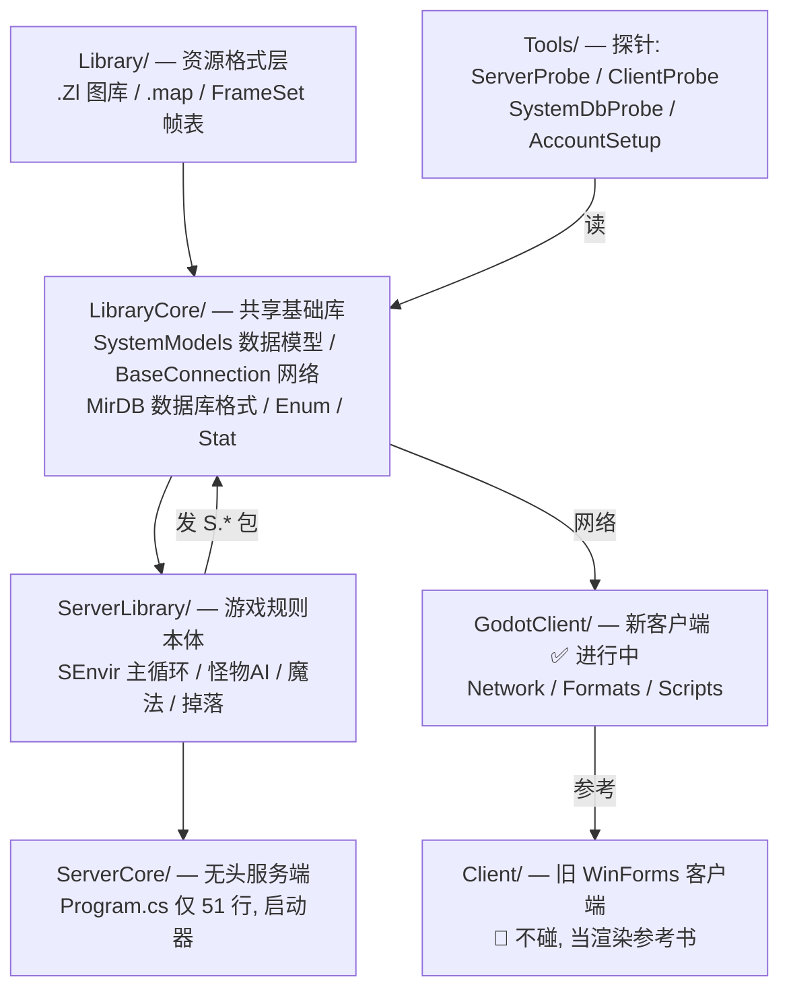

# 讨论记录 06：学习路线 + Godot 客户端实现解析

> 日期：2026-08-06
> 性质：学习材料。前半篇是仓库学习路线（怎么入手），后半篇回答"Godot 客户端怎么跟服务端通讯、怎么实现的、参考了什么、能做到什么程度"。

---

## 第一部分：学习路线（怎么入手）

### 仓库分层（这就是实现思路本身）



**规则全在服务端（ServerLibrary）**，客户端是"提线木偶"——这是讨论 01 的核心认知，也是整个项目的基石。

### 五步学习法

**① 先读思路，别碰代码（30 分钟）**
`docs/notes/01~05.md` 按顺序读：
- 01：为什么把服务端搬进本地（单机化原理、复用边界 7:3）
- 02：为什么改成在线客户端（两个"服务端"的区分：`Server/` 编辑器 vs `ServerCore/` 真服务器）
- 03：Linux 跑通踩坑（路径分隔符）
- 04：协议链路验证（最小客户端）
- 05：Godot 骨架（当前最新，第 2 步完成）

**② 用数据建立直觉（30 分钟）**
```bash
dotnet run --project Tools/SystemDbProbe                 # 各表数量
dotnet run --project Tools/SystemDbProbe -- --view docs/database/views  # 玩家视图
```
先知道"这游戏里有什么"——244 地图、309 怪、1078 物品、174 魔法——再读代码就有画面了。

**③ 看服务端怎么"活"（重点，2-3 小时）**
1. `ServerCore/Program.cs`（51 行）——服务端入口
2. `ServerLibrary/Envir/SEnvir.cs:1373` 的 `EnvirLoop`——游戏世界发动机
   （结构：`Now` → 玩家 `StartProcess` → 分批 tick `ActiveObjects` → 定时存档）
3. 追一只怪的 AI：`MonsterObject` 的 `ProcessAI / ProcessSearch / ProcessRoam / ProcessTarget`（巡逻→发现→追击→攻击→回血）
4. 挑一个魔法：`MagicInfo` 模型 → 魔法释放逻辑

**④ 看网络链路（1-2 小时）**
1. `LibraryCore/BaseConnection.cs`——包收发基类（`Enqueue` 是发包出口）
2. `GodotClient/Network/ServerConnection.cs`——客户端怎么收包
3. 对照笔记 05 的协议流程图：`Connected → GoodVersion → Login → NewCharacter → StartGame`

**⑤ 看渲染（第 3 步正在做的事，按需深入）**
`docs/RENDERING_PORT_GUIDE.md`（4300 行）把旧客户端所有硬编码数据抽成了表格。配合读：
- `Client/Models/MapObject.cs`（坐标/帧公式原型）
- `GodotClient/Formats/ZlReader.cs / MapReader.cs`（已移植的读取器）
- `GodotClient/Scripts/MapView.cs / MapTestScene.cs`（进行中的渲染）

### 实践入口

```bash
cd /tmp/zircon-server && dotnet ServerCore.dll        # 1. 启动服务端
~/.local/bin/godot-mono --path GodotClient/           # 2. 启动 Godot 客户端
~/.local/bin/godot-mono --headless --path GodotClient/ -- --auto-login  # 3. headless 自动测试
```
账号 `test@test.com` / `test123`。

### 两个避坑提醒
- 别碰 `Client/` 和 `Server/` 的 WinForms 代码——只当"参考书"查渲染数据
- 每篇笔记末尾的**踩坑表**先扫一遍（`sealed` SConnection、`CallDeferred` 不能传 `List<>`、`Godot.NET.Sdk` 必须带版本号……）

---

## 第二部分：Godot 客户端怎么跟服务端通讯

### 1. 链路总览（读代码确认，非推测）

```
服务端 ServerCore (127.0.0.1:7000)
   │
   │  TCP socket（异步）
   ▼
LibraryCore/BaseConnection  ←── 服务端与客户端共用同一基类
   │  SendList 待发队列 / ReceiveList 待处理队列
   ▼
GodotClient/Network/ServerConnection : BaseConnection
   │  收到包 → Process(XxxPacket) → C# event
   ▼
UI 层 (LoginScene / SelectScene / GameScene)
   │  CallDeferred 延迟到主线程
   ▼
Godot 节点操作
```

**关键点：服务端和客户端用的是同一份网络代码**（`LibraryCore/Network/BaseConnection.cs` + `Packet.cs`）。这就是讨论 02 说的"网络层现成可复用"——客户端不是重写网络，而是**继承**。

### 2. 收包：异步 socket + 每帧排空队列

`BaseConnection`（`LibraryCore/Network/BaseConnection.cs`，389 行）的设计：

- **收**：`BeginReceive()` 起异步 socket，`ReceiveData` 回调跑在 .NET 线程池线程，把收到的包 `ReceiveList.Enqueue(p)`；
- **处理**：`Process()` 在游戏主线程每帧被调用，`while (!ReceiveList.IsEmpty) ProcessPacket(p)` 排空队列，分发到 `Process(XxxPacket)`；
- **发**：`Enqueue(new C.Move{...})` 进 `SendList`，`Process()` 里统一 `BeginSend` 刷出。

`NetworkManager`（autoload 单例）就是干这件事：

```csharp
public override void _Process(double delta)
{
    if (Connection != null && Connection.Connected)
        Connection.Process();   // 每帧排空收到的包
}
```

### 3. 收包分发：Process(XxxPacket) → C# event

`ServerConnection` 只做两件事：**收到包转成 C# event**、**UI 调 Send* 发包**。现在实现了约 10 种包的处理器：

| 已处理包 | 用途 |
|---|---|
| `G.Connected` / `G.GoodVersion` / `G.Disconnect` / `G.Ping` | 连接握手、版本校验、保活 |
| `S.Login` / `S.NewAccount` / `S.NewCharacter` | 登录 / 注册 / 建角色结果 |
| `S.StartGame` | 进入游戏结果（含玩家 ObjectID / 位置 / 方向） |
| `S.MapChanged` / `S.UserLocation` | 地图切换 / 玩家坐标更新 |

发包侧（UI 调用）：`SendLogin` / `SendNewAccount` / `SendNewCharacter` / `SendStartGame`，游戏内已能发 `C.Move`（方向键移动）。

### 4. 线程安全：CallDeferred

异步 socket 的收包回调在**线程池线程**，不是 Godot 主线程。直接在回调里操作 Godot 节点会崩。模式：

```csharp
private void OnLoginResult(LoginResult result, string message, List<SelectInfo> characters)
{
    _pendingCharacters = characters;      // 存成员变量
    CallDeferred(nameof(ShowLoginResult)); // 延迟到主线程执行
}
```
注意 `CallDeferred` 只接受 Godot Variant 参数，`List<SelectInfo>` 不是 Variant，所以数据走成员变量、方法无参。

### 5. 序列化方向

`NetworkManager.Connect()` 里 `Packet.IsClient = true`——同一个 `Packet` 类在服务端/客户端两侧序列化方向相反（服务端发 S.*、收 C.*；客户端反之）。

---

## 第三部分：客户端是怎么实现的

### 工程结构（GodotClient/）

```
GodotClient/
├── project.godot              Godot 工程配置（autoload NetworkManager）
├── ZirconClient.csproj        Godot.NET.Sdk/4.6.0 + net10.0 + 引用 ../LibraryCore
├── Network/
│   ├── NetworkManager.cs      连接生命周期 + 每帧 Process()
│   └── ServerConnection.cs    继承 BaseConnection，收包→event，UI→发包
├── Formats/
│   ├── ZlReader.cs            .Zl 图库读取器（移植自 LibraryEditor/WeMadeLibrary）
│   ├── MapReader.cs           .map 地图读取器
│   └── BcnDecoder.cs          BCn 压缩解码（替代 Windows 的 ManagedSquish.dll）
├── Scripts/
│   ├── LoginScene.cs / SelectScene.cs / GameScene.cs  三阶段 UI 逻辑
│   ├── MapView.cs             地图渲染视图（Node2D，按 48×32 格绘制）
│   ├── MapTestScene.cs / ZlViewer.cs  渲染实验场景
└── Scenes/                    .tscn 界面布局
```

### 三阶段流程

1. **LoginScene**：账号密码 → `SendLogin` → `LoginResultEvent` → 有角色进 SelectScene，无角色 `SendNewAccount` 注册
2. **SelectScene**：角色列表 + `SendNewCharacter` 建角色 + `SendStartGame` 进入
3. **GameScene**：`StartGameResultEvent` 成功 → 拿到玩家 ObjectID/位置/方向 → `LoadPlayerMap()` 加载 .map → 画玩家（当前是红色方块占位）→ 方向键发 `C.Move`

### 当前进度（第 2 步完成，第 3 步进行中）

- 已通：登录 → 选角色 → 建角色 → StartGame → MapChanged → UserLocation → 加载地图 → 显示位置 → 方向键发包
- 未做（GameScene.cs:126 的 TODO）：`MapIndex → MapInfo.FileName` 的映射还是硬编码 `LoadMap("0")`；玩家是红方块；地图只渲染了地形层

---

## 第四部分：搬运了三档代码

先说清楚一个大前提：**这个仓库没有 C 代码，全是 C#（.NET）**。唯一的 native 部件是 Windows 的 `ManagedSquish.dll`（C++ 写的 DXT 压缩库），已经用纯托管的 `BCnEncoder.NET` 替代。所以不存在"把 C 代码拿过来"——搬的都是 C#，"搬"的方式分三档：

### ① 直接引用（整包拿来，编译进客户端）

`LibraryCore/` 整个项目，csproj 一行引用：

```xml
<ProjectReference Include="..\LibraryCore\LibraryCore.csproj" />
```

里面是服务端和客户端**共享的公共底座**，原样用、一行不改：

| 内容 | 位置 | 用途 |
|---|---|---|
| 网络收发 | `Network/BaseConnection.cs`、`Packet.cs` | 客户端**继承**它，服务端也用它——同一份网络代码 |
| 数据模型 | `SystemModels/` | 物品/怪物/魔法/地图……所有数据定义 |
| 数据库格式 | `MirDB/` | System.db 的读写 |
| 枚举/属性/帧表 | `Enum.cs`、`Stat.cs`、`FrameSet.cs` | 游戏里所有枚举与属性定义 |

### ② 移植（代码抄过来，改造成 Godot 版）

`GodotClient/Formats/` 里的资源格式读取器——纯文件读写逻辑，从工具/旧客户端里搬出来：

| 文件 | 抄自 | 干什么 |
|---|---|---|
| `ZlReader.cs` | `LibraryEditor/WeMadeLibrary.cs` | 读 .Zl 图库（游戏里所有图片的容器格式） |
| `MapReader.cs` | `Client/.../MapControl.cs:484-545` | 读 .map 地图文件（地面/中间/前景三层格子） |
| `BcnDecoder.cs` | 替代 `ManagedSquish.dll`（native） | DXT1/5/BC7 压缩图片解码，用 NuGet 纯托管包 |

### ③ 参考（不搬代码，只当答案书）

**旧客户端 `Client/` 的代码一行都没搬**——它只是参考书：

| 参考 | 用法 |
|---|---|
| `CConnection.cs`（5109 行，219 个包处理器） | 每个包该做什么的**参考答案**，在 Godot 里用 C# event 重写 |
| `Client/Models/MapObject.cs` 等渲染模型 | 坐标/帧公式原型，`RENDERING_PORT_GUIDE.md` 已抽成表 |
| `RENDERING_PORT_GUIDE.md`（4300 行） | 153 魔法/266 特效/191 音效/94 帧表/291 怪物图像映射，逐条可对照 |

### 总结

```
服务端 = 核心，原样跑（跨平台，Linux 直接 dotnet 启动）
编辑器 = Windows 专用，不需要
客户端 = Godot 新外壳：
   ├─ 共享底座 LibraryCore → 直接引用（原样）
   ├─ 格式读取器          → 从 LibraryEditor/旧客户端移植
   ├─ 包处理逻辑          → 参考旧客户端重写（新写代码）
   └─ 渲染/UI             → 全新写（Godot 原生）
```

"外壳"的比喻对，但壳里**不是塞旧代码**——是"共享库整包拿 + 读取器移植 + 逻辑参考重写"。复用大头是 `LibraryCore`（网络、数据模型、格式），这正是讨论 01 说的"复用 7 成"。

---

## 第五部分：能实现到什么程度

### 协议是天花板：219 个包处理器

- 服务端→客户端包：**216 种**（`ServerPackets.cs`）；客户端→服务端：**153 种**（`ClientPackets.cs`）
- 旧客户端实现了 **219 个** `Process(S.*/G.*)` 处理器，基本全覆盖
- 新客户端当前：**约 10 个**（握手/登录/选角/基础移动）

**"最终能实现到什么程度"= 这 219 个包逐个数完，旧客户端有的功能都能有。** 包名本身就是功能清单：

```
移动/战斗/背包/装备/掉落/商店/NPC/任务/组队/行会/好友/交易/邮件
宠物(Companion)/坐骑(Horse)/钓鱼/商店(拍卖)/结婚/攻城(沙巴克)/事件/修炼/声望
Buff/魔法盾/隐身/变身/世界事件/里程碑/成就/Fame/Discipline ...
```

### 功能对应关系（包 → 游戏系统）

| 包前缀 | 系统 | 状态 |
|---|---|---|
| `S.Move` / `S.UserLocation` / `S.ObjectPlayer` | 移动与可见物 | 🔄 第 4 步起点 |
| `S.Strike` / `S.Magic` / `S.MonsterStrike` | 战斗与魔法 | ⏳ |
| `S.UserItem` / `S.ItemInfo` / `S.GainedItem` | 背包与装备 | ⏳ |
| `S.NPC` / `S.NPCConsignment` / `S.Quest*` | NPC 与任务 | ⏳ |
| `S.Guild*` / `S.Group*` / `S.Friend*` | 社交系统 | ⏳ |
| `S.Companion*` / `S.Horse*` / `S.Fishing*` | 宠物/坐骑/钓鱼 | ⏳ |
| `S.Castle*`（沙巴克攻城） | 攻城战 | 💤 远期 |

### 路线图

| 步骤 | 内容 | 状态 |
|---|---|---|
| 第 0 步 | Linux 编译 + 读 System.db | ✅ |
| 第 1 步 | 服务端本机跑通 + 协议链路 | ✅ |
| 第 2 步 | Godot 客户端骨架：登录/选角色全流程 | ✅ |
| 第 3 步 | .Zl/.map 读取器 + 地图渲染 | 🔄 进行中 |
| 第 4 步 | 逐 packet 接渲染：走路→攻击→背包→魔法，直至可玩 | ⏳ |
| 第 5 步（远期） | 导出 web，连远程服务端 | 💤 |

### 实际约束（不是做不到，是没到那步）

- 玩家角色、行会等动态数据在 `Users.db`，**新客户端只连服务端、不碰用户数据文件**——都由服务端管
- 渲染特效/音效依赖 .Zl 图库与 .wav 资源（已下载在 `Debug/`），BcnDecoder 已解决 DXT 解码
- web 导出的瓶颈：Godot web 版 + 网络层（WebSocket）需适配，属第 5 步范畴
