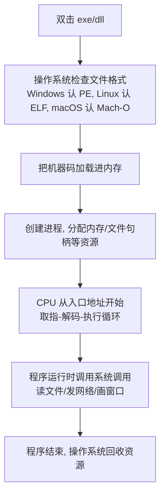
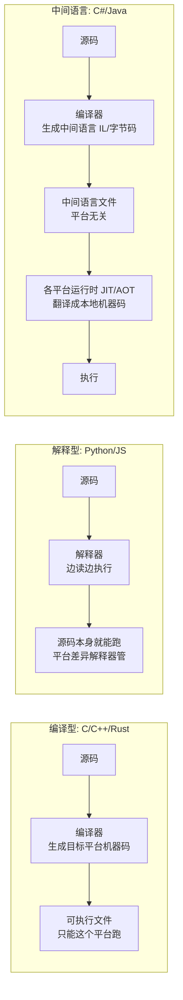
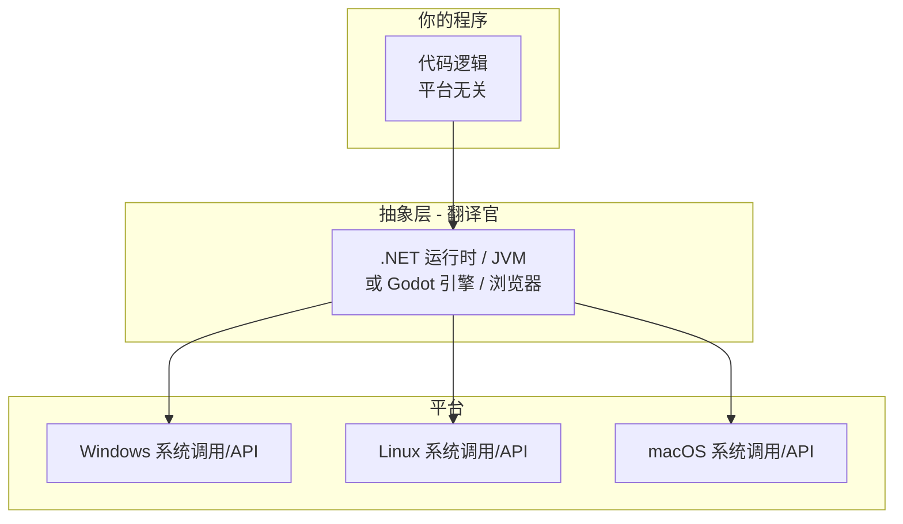

# 讨论记录 07：计算机运行原理与跨平台详解

> 日期：2026-08-06
> 性质：学习材料。回答三个问题：① 服务端为什么跨平台？② Godot 怎么跨平台？③ 为什么有些程序跨平台、有些不行？越到后面越深入，可以跳着读。

---

## 0. 先给结论（详细解释在正文）

| 问题 | 一句话答案 |
|---|---|
| 服务端为什么跨平台？ | C# 编译成中间语言（IL），各平台有 .NET 运行时替它翻译成本地指令。同一个 dll，Windows/Linux/Mac 都能跑 |
| Godot 怎么跨平台？ | 引擎本身是 C++，**每平台编译一次**；游戏代码跑在引擎的抽象层上，引擎把差异全挡住 |
| 为什么有的程序能跨、有的不能？ | 程序 = 代码逻辑 + 依赖。逻辑用中间语言写就天生跨平台；**依赖一旦碰了平台专属的东西（Windows 界面库、DirectX）就锁死** |

三个答案背后是同一个问题：**"代码逻辑"和"具体机器"之间的那层翻译，是谁做的、在哪做的。** 全文围绕这个展开。

---

## 1. 计算机是怎么运行的

要理解跨平台，先得理解"一个程序跑起来"到底发生了什么。

### 1.1 从 0 和 1 说起

计算机最底层只有两种状态：有电/没电，对应数字 **0 和 1**。所有东西——数字、文字、图片、声音、程序本身——最终都是 0 和 1 的序列。

但"全是 0 和 1"不等于"随便怎么排都行"。0 和 1 需要**约定**才有意义：

| 层次 | 内容 | 例子 |
|---|---|---|
| 二进制 | 原始的 0/1 串 | `1011 0001 1001 0000` |
| 机器码 | 约定：前 8 位是"操作码"，后面是"操作数" | 这段二进制 = "把寄存器 A 的值加 1" |
| 汇编 | 给机器码起的名字（人类可读的机器码） | `ADD RAX, 1` |
| 高级语言 | 再抽象一层 | `x = x + 1;` |

**机器码是 CPU 唯一真正懂的语言**。你的电脑里几十亿个晶体管，只认识一种约定：哪段二进制表示"加法"、哪段表示"跳转"、哪段表示"从内存读数据"。

### 1.2 CPU 的流水线：取指 → 解码 → 执行

CPU（中央处理器）干活的方式非常简单，重复一个四步循环：


- **寄存器**：CPU 内部极小的存储单元（几十个），做运算的"工作台"。任何计算都是"把数搬进寄存器 → 算 → 搬出去"
- **缓存（Cache）**：CPU 和内存之间的小块高速存储。CPU 太快，内存太慢，缓存当缓冲
- **主内存（RAM）**：程序和数据的家。CPU 只能通过"地址"访问内存（把内存想象成一个超大的数组，下标就是地址）

一个程序"跑起来"，本质就是：**操作系统把它的机器码加载进内存，告诉 CPU 从哪条指令开始，CPU 就进入取指-解码-执行的循环，一条一条把指令跑完。** 就这么简单，没有魔法。

### 1.3 指令集架构（ISA）：CPU 的"方言"

问题是：**不同 CPU 的"机器码约定"不一样。**

- **x86 / x86-64**：Intel、AMD 的 CPU（绝大多数台式机、服务器、老笔记本）
- **ARM / ARM64**：手机芯片、Apple M 系列、树莓派、**你这台跑 Asahi Linux 的 M1 Max**（`uname -m` 输出 `aarch64`）

同一句 C 代码 `x = x + 1`，在 x86 上编译出来是一种二进制，在 ARM 上编译出来是另一种二进制——**指令集不同，机器码不通用**。

> 本机就活生生的例子：你 `uname -m` 看到 `aarch64`，这就是 ARM64 指令集。而很多网上下的 Windows 软件是 x86 的——它们在你机器上跑不了，一半原因在这。

### 1.4 操作系统：硬件的大管家

CPU 不会自己管理硬盘、屏幕、网卡、内存。这些活由一个更底层的程序干：**操作系统（OS）**。

操作系统提供两类东西：

1. **系统调用（syscall）**：让程序安全地碰硬件。程序要读文件、发网络包、开窗口，都通过"系统调用"请操作系统代劳
2. **进程/线程调度**：很多程序同时跑，操作系统分时给每个程序一点 CPU 时间

**关键点：系统调用也是各平台不同的。** Windows 有一套系统调用，Linux 有一套，macOS 有一套。这直接导致了下面要讲的"跨平台难"。

### 1.5 一个程序从双击到运行（全链路）



注意 B 这一步：**可执行文件格式也是平台专属的**。同样一个程序，Windows 上的文件头和 Linux 上的文件头结构都不一样。这是"平台锁"的第二道。

---

## 2. 代码是怎么变成程序的

高级语言 → 机器码，有 **三种转化方式**，跨平台能力完全不同。

### 2.1 三种方式总览



### 2.2 编译型（C/C++）：一次编译，到处……重新编译

C 源码 → 编译器 → **特定平台的机器码**。这个机器码只认识一个平台：

- 在 Windows 上编译 → 得到 `.exe`（PE 格式 + x86 指令 + 调用 Windows API）
- 在 Linux 上编译 → 得到 ELF 格式可执行文件

**"C 能跨平台"的意思是"源码能拿到别的平台重新编译一遍"**——不是编译产物能直接跑。所以你拿到一个开源 C 项目，要在 Linux 上用，得先 `./configure && make`，那就是"重新编译"的过程。

- ✅ 优点：性能最高（产物就是原生机器码），无运行时依赖
- ❌ 缺点：**每发布一个平台，就要为那个平台单独编译一份**。Linux 发行版有几十个，每个都要编

### 2.3 解释型（Python）：现场翻译

Python 源码不需要编译，直接 `python3 xxx.py` 就能跑。因为**解释器**（python3 这个程序）一边读源码一边执行。

- ✅ 源码到处能跑：只要那个平台装了 Python 解释器
- ❌ 缺点：慢（翻译开销大）；而且"能不能跑"依赖那个平台装没装 Python 和依赖库

### 2.4 中间语言 + 运行时（C#/.NET、Java/JVM）：普通话 + 本地翻译官

这是服务端跨平台的答案，重点讲。

C# 源码编译后**不是机器码，而是中间语言（IL / CIL）**——一种平台无关的"通用指令"。真正干活的是各平台上的 **.NET 运行时**：

```
C# 源码 ──编译器──▶ IL 文件 (xxx.dll, 平台无关)
                          │
          ┌───────────────┼───────────────┐
          ▼               ▼               ▼
   Windows 的 .NET   Linux 的 .NET   macOS 的 .NET
   （翻译成本地机器码）（翻译成本地机器码）（翻译成本地机器码）
```

**同一个 `ServerCore.dll`，拷到 Windows 能跑、拷到 Linux 能跑**——因为各平台的 .NET 运行时都认识 IL，各自把它翻译成自己平台的机器码。

运行时内部有两种执行方式：

| 方式 | 全称 | 怎么做 | 特点 |
|---|---|---|---|
| **JIT** | Just-In-Time | 运行时边跑边把 IL 编译成机器码，编译结果缓存 | 启动稍慢，之后快（默认方式） |
| **AOT** | Ahead-Of-Time | 发布时直接把 IL 编译成机器码 | 启动快、内存小，但发布物变成平台专属 |

> 你机器上跑着 `Microsoft.NETCore.App 10.0.10`——这就是 Linux ARM64 版本的 .NET 运行时。服务端能在这台 M1 Max 上跑，就是它在翻译 IL。

### 2.5 为什么 .NET 不慢？（别被"中间多一层"骗了）

直觉上"多翻译一层"应该慢。但：

1. **JIT 编译一次，执行多次**：游戏主循环里 `Enqueue()` 调用百万次，翻译只发生第一次
2. **JIT 能做运行时优化**：C 编译器是"盲人摸象"式优化，JIT 能看到程序实际怎么跑，做针对性优化（内联、去边界检查）——有时候反而比 C 快
3. **AOT 选项**：要极致启动速度，发布时直接编成机器码（代价是发布物平台专属）

---

## 3. 跨平台为什么难：三把锁

一个程序要跨平台，要同时打开三把锁。缺一把就锁死。

### 3.1 锁一：CPU 指令集

- x86 vs ARM，机器码不通用
- **解法**：编译成 IL（.NET）、字节码（Java），或每平台编译一次（C）

### 3.2 锁二：操作系统 ABI（文件格式 + 系统调用）

- 可执行文件格式：Windows 认 PE（.exe/.dll）、Linux 认 ELF、macOS 认 Mach-O
- 系统调用：读文件、开网络、开窗口的"官方接口"各平台不同
- **解法**：运行时/引擎封装系统调用，或条件编译（`#if WINDOWS`）

### 3.3 锁三：平台专属 API（最阴险的一把）

这是**程序员的代码里自己引用的东西**：

| 平台专属 | 属于 | 常见用途 |
|---|---|---|
| WinForms / WPF | Windows | 界面库 |
| DirectX | Windows | 图形/声音 |
| Win32 API | Windows | 系统功能 |
| MFC / COM | Windows | 各种 |

**只要代码里 `using System.Windows.Forms`，这个程序就只能 Windows 跑**——因为 .NET 运行时的 WinForms 实现只在 Windows 上有，Linux 上的 .NET 运行时根本没有这层。

### 3.4 开锁的本质：抽象层（Abstraction）

所有跨平台方案的共同内核，就一句话：

> **在"我的逻辑"和"具体平台"之间，插一层翻译。**



**跨平台能力 = 你的代码是否愿意通过抽象层说话。**

- 只用抽象层的 API（网络、文件、数学）→ 跨平台
- 绕过抽象层直接喊平台专属 API（WinForms、DirectX）→ 锁死

---

## 4. 跨平台的六种套路（真实世界的方案）

| 套路 | 代表 | 抽象层是谁 | 性能 | 缺点 |
|---|---|---|---|---|
| ① 源码重编译 | C/C++、Rust | 无（每平台编一次） | 最高 | 发布维护成本高 |
| ② 中间语言+运行时 | C#/.NET、Java/JVM | 运行时 | 高（JIT） | 首次启动稍慢 |
| ③ 解释执行 | Python、Ruby | 解释器 | 低 | 慢、依赖环境 |
| ④ 引擎/框架抽象 | Godot、Qt、浏览器 | 引擎/框架 | 高（引擎优化） | 受引擎能力限制 |
| ⑤ 容器 | Docker | 内核特性+镜像 | 接近原生 | 只解决 Linux 内部差异 |
| ⑥ 一切皆 Web | 网页应用、WebAssembly | 浏览器 | 中 | 沙箱限制 |

### 4.4 引擎/框架抽象（重点：Godot 属于这类）

引擎（游戏引擎、GUI 框架）自己是用 C++ 写的，**引擎本身每平台编译一次**，分发时给每个平台一个版本。但引擎内部把所有平台差异都封装了：

- 画窗口 → 引擎封装（Godot 底层用各平台原生窗口）
- 渲染 → 引擎统一走 OpenGL/Vulkan/Metal
- 输入/文件/声音/网络 → 引擎全部封装

**游戏开发者写的代码（GDScript/C#）只跟引擎说话**，引擎替你跟三个平台沟通。所以：

- 引擎 = "游戏的 .NET 运行时"（用 C++ 实现，每平台编译）
- 游戏代码 = "IL"（平台无关，引擎统一加载执行）

这就是 **Godot 跨平台的完整答案**，第 6 节详细展开。

### 4.5 容器（Docker）

Docker 不算真正的跨平台——它解决的是 **"同一 Linux 内核上的环境差异"**（库版本、路径、配置）。本质是把"你的程序和它需要的整个环境"打包成一个镜像，在任何 Linux 上跑。镜像里是 Linux 的二进制，所以 Windows/Mac 上跑 Docker 其实是开了一个 Linux 虚拟机。

### 4.6 一切皆 Web

浏览器是目前最成功的跨平台抽象层——**几乎所有平台都有浏览器**。把程序编译成 JS/WebAssembly 跑在浏览器里，等于一步跨过三把锁。这就是你们第 5 步"客户端导出 web"能实现的原因：Godot 支持导出为 HTML5 版，游戏代码不变，引擎把渲染翻译成 WebGL/WebGPU。

---

## 5. 用 Zircon 仓库做完整案例分析

现在用你自己的仓库把上面所有理论串一遍。三个程序，两种结局，一门语言。

### 5.1 服务端（ServerCore + ServerLibrary）：为什么跨平台 ✅

| 项目 | 内容 |
|---|---|
| 语言 | C# |
| 编译产物 | IL 格式的 `ServerCore.dll` |
| 用的 API | 只用 .NET 标准库：网络（TcpListener/Socket）、文件、集合、数据库（SQLite） |
| 碰了平台专属吗？ | **没有**。没有任何 WinForms/DirectX/Win32 |

所以：`dotnet ServerCore.dll` 在 Linux 跑（你现在就这么干），同一个文件拷到 Windows 装个 .NET 运行时照样跑。**你没做任何"跨平台适配"，是 .NET 运行时替你做了。**

服务端里唯一有点平台味的是路径分隔符（笔记 03 的坑：`\` vs `/`）——但那只影响**字符串拼接**，不影响"能不能跑"，改个写法就兼容了。

### 5.2 旧客户端（Client/）：为什么锁死 Windows ❌

**同样是 C#！** 但代码里用了：

- `System.Windows.Forms`（界面，45 个窗口全用它）
- `SharpDX.DirectSound`（声音，`DXSound.cs`/`DXSoundManager.cs`）
- `System.Drawing`（GDI+ 渲染，`DXControl` 的自绘全用它）

这三样在 Linux 的 .NET 运行时上**根本不存在**（运行时没有实现它们）。所以这个程序**只能在 Windows 跑**——不是"跑起来有问题"，是"装都不让装"。

> 这就是"语言一样，结局不同"的最好教材：**决定跨不跨平台的不是 C# 这门语言，是它引用了什么。**

### 5.3 新客户端（GodotClient）：为什么跨平台 ✅

- C# 代码只调用：Godot API（`Godot.*`）+ .NET 标准库 + 自己移植的读取器
- Godot 引擎本身跨平台（见第 6 节）
- 渲染走 Vulkan（你跑的时候日志里 `Vulkan 1.4.335 - Forward+`），Vulkan 是跨平台的图形接口，Windows/Linux/Mac 都有

所以新客户端**现在在 Linux 跑，将来 Godot 导出 Windows/Mac/web 版本，代码一行不用改**。

### 5.4 一张表看清三者

| | 语言 | 抽象层 | 用的 API | 跨平台 |
|---|---|---|---|---|
| 服务端 | C# | .NET 运行时 | 标准库 | ✅ |
| 旧客户端 | C# | .NET 运行时 | WinForms/DirectSound/GDI+ | ❌ 只有 Windows |
| 新客户端 | C# | Godot 引擎 + .NET | Godot API + 标准库 | ✅ |

**一句话：三个程序都是 C#，跨不跨平台只取决于"往抽象层外面伸了多远"。** 服务端和新客户端老实待在抽象层里，旧客户端伸出去抓了 Windows 的东西。

---

## 6. Godot 深度：一个游戏引擎怎么跨平台

### 6.1 Godot 自己是什么写的

C++。引擎本体是编译型程序——**Godot 官方发布时，给每个平台编译一份**：

```
Godot 发行包:
  godot-windows-x86_64.exe   (Windows 的 C++ 机器码)
  godot-linux-arm64           (Linux ARM 的 C++ 机器码 ← 你用的这个)
  godot-macos                (macOS 的 C++ 机器码)
```

你机器上 `~/.local/bin/godot-mono` 就是 **Linux ARM64 版**的引擎（这机器是 `aarch64`）。它在 M1 Max 上跑得飞快，因为它是为这个 CPU 原生编译的。

### 6.2 渲染抽象：OpenGL / Vulkan / Metal

游戏引擎最难跨的是**图形**——因为 3D 渲染要直接操控 GPU，而 GPU 的接口各平台不同：

| 图形接口 | 谁在用 |
|---|---|
| DirectX 12 | Windows 专属 |
| Metal | macOS/iOS 专属 |
| OpenGL / Vulkan | **跨平台**（Windows/Linux/Mac/Android 都有） |

Godot 的渲染层把这三者都封装了：**你写 `DrawTextureRect()` 时，Godot 在 Windows 上翻译成 DirectX 调用，在 Linux 上翻译成 Vulkan 调用**（日志里 `Vulkan 1.4.335 - Forward+` 就是你机器上的翻译路径），在 Mac 上翻译成 Metal。这就是"引擎替你开锁三"。

> 浏览器里更极端：Godot 导出 web 版时，渲染翻译成 WebGL/WebGPU——又一个图形接口。

### 6.3 窗口/输入/文件/声音的抽象

图形之外还有一堆平台差异，Godot 全部封装：

- **窗口**：Windows 用 Win32、Linux 用 X11/Wayland、Mac 用 Cocoa——Godot 统一成 `Window`
- **输入**：键盘/鼠标/手柄事件统一成 `InputEvent`
- **文件**：统一成 `FileAccess`（所以你的 GodotClient 里 `File.OpenRead` 路径分隔符的坑是 .NET 的，不是 Godot 的）
- **声音**：Windows 用 WASAPI、Linux 用 PulseAudio/PipeWire、Mac 用 CoreAudio——Godot 统一成 `AudioStreamPlayer`

### 6.4 游戏代码怎么跨平台

你写的 C#（`LoginScene.cs`、`MapView.cs`、新的 `Controls/`）**只跟 Godot API 说话**，`using Godot;` 那一行就是"我保证只通过抽象层说话"的承诺。引擎在哪个平台跑，你的代码就跟着在哪个平台跑，**你写的代码不针对任何平台**。

### 6.5 打包发布：每平台一个包

游戏做完要发布，流程是：

```
同一个 Godot 工程
   ├─ 导出 Windows 版 → 一个 exe + 引擎 + 资源
   ├─ 导出 Linux 版   → 一个可执行文件 + 引擎 + 资源
   ├─ 导出 macOS 版   → 一个 .app
   └─ 导出 web 版     → HTML + wasm（浏览器跑）
```

引擎给每个平台编一份（这是引擎作者的事），**你的游戏代码/资源原样打包进去**。这就是为什么"Godot 客户端导出 web"是可行的——第 5 步远期计划靠的就是这个。

---

## 7. 常见误区纠正

**误区 1："C 是跨平台语言"**
错。C **源码**能拿到别的平台重新编译，但编译**产物**只能在当前平台跑。说"C 跨平台"指的是前者。严格讲：C 是"可移植的语言"，不是"跨平台的程序"。

**误区 2："C# 只能写 Windows 程序"**
这是 .NET Framework 时代（2002-2016）的老黄历。2016 年 .NET Core 起，C# 全平台可用。服务端就是铁证——Linux 上跑得好好的。

**误区 3："跨平台 = 性能差"**
不一定。.NET JIT 性能接近 C（甚至能超，因为运行时优化）；Godot 引擎是原生 C++，游戏代码的 GDScript/C# 才慢一点，但真正吃性能的渲染在引擎 C++ 层。真要极致，.NET 还能 AOT 编成原生机器码。

**误区 4："网页版 = 画质差"**
老黄历。WebGPU + WebAssembly 时代，浏览器能跑接近原生的 3D。Godot 4 导出 web 的渲染管线跟桌面版一样。

**误区 5："解释型语言（Python）跨平台最好"**
"最好跑"但"最慢"。而且 Python 的依赖（pip 包）也常有平台专属的编译产物，真实世界跨平台没那么干净。

---

## 8. 术语表

| 术语 | 含义 |
|---|---|
| 机器码 | CPU 真正执行的二进制指令，平台专属 |
| 指令集架构 (ISA) | CPU 的"方言"：x86、ARM64 等 |
| 寄存器 | CPU 内部的工作台存储 |
| 系统调用 (syscall) | 程序请操作系统干活（读文件/开网络/开窗口）的接口 |
| ABI | 二进制层面的接口约定（文件格式 + 系统调用 + 调用约定） |
| PE / ELF / Mach-O | Windows / Linux / macOS 的可执行文件格式 |
| IL / CIL | C# 编译出的中间语言，平台无关 |
| JIT | 运行时边跑边编译（Just-In-Time） |
| AOT | 发布时编译成机器码（Ahead-Of-Time） |
| 抽象层 | 逻辑与平台之间的翻译层（.NET 运行时、JVM、Godot 引擎、浏览器） |
| WinForms / WPF | Windows 专属界面库 |
| DirectX / Vulkan / Metal | 图形接口（Windows 专属 / 跨平台 / macOS 专属） |
| WebAssembly (wasm) | 浏览器里的"通用机器码"，几乎任何语言能编译成它 |

---

## 附：为什么这些对你（Zircon 项目）重要

1. **服务端跨平台是白送的**：.NET 运行时替你扛了。你只需要遵守一条纪律——**别往服务端代码里引 Windows 专属 API**（现在没引，继续保持）
2. **旧客户端是反面教材**：同样是 C#，WinForms 一行就锁死。将来要参考它的代码时，记住"它锁死不是因为思路，是因为依赖"
3. **新客户端的未来是敞开的**：Godot 抽象层已经铺好，第 5 步"导出 web"不需要重写任何游戏逻辑，只是导出一个新平台包
4. **遇到"为什么跑不了"的报错**，先问三把锁：CPU 指令集（`uname -m`）→ 文件格式 → 依赖的 API。九成的"跨平台失败"都能用这三把锁定位
