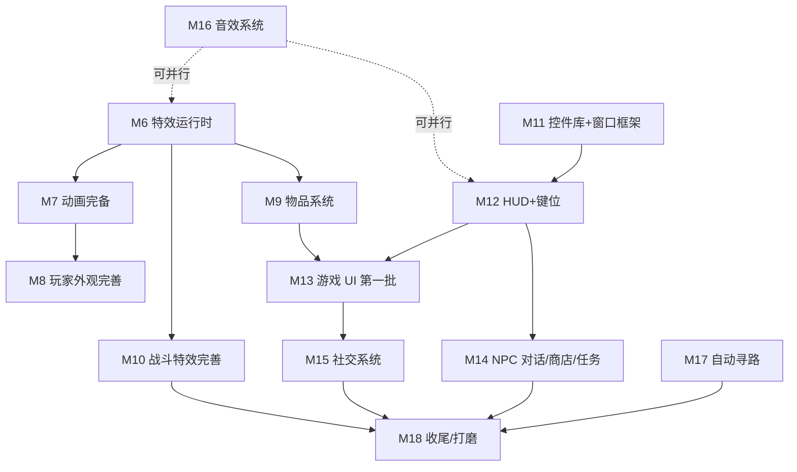

# 15. 完全移植计划 —— 与原版对比

> 本篇是**规划文档**，不改代码。目的是把当前"能进游戏走两步"的基础客户端，推进到"与原版 WinForms 客户端功能一致、可玩可用"。
>
> 基于对原版 `Client/` 全量代码（GameScene 5020 行 / CConnection 5109 行 / MapObject 6159 行 / MonsterObject 3871 行 / 40+ Dialog / 31 个 DX 控件 / 3166 个音效）与当前 `GodotClient/` 的逐项对比，产出分里程碑的实施路线。

---

## 一、现状对比总览

| 维度 | 原版 | 当前 Godot 版 | 差距 |
|------|------|---------------|------|
| **网络包** | CConnection 处理 213 个 S.* 包 | ServerConnection 处理 25 个 | 缺 ~188 个（可玩必需 ~30） |
| **客户端发包** | 153 个 C.* 包 | 5 个（Login/Move/NewAccount/NewCharacter/StartGame） | 缺 ~148 个 |
| **游戏内 UI** | 40+ Dialog 面板 | 无 | 全缺 |
| **HUD** | MainPanel 血/蓝/斗气/经验条 + 9 按钮 + 小/大地图 + 魔法快捷栏 + 腰带 + Buff | 无 | 全缺 |
| **键位系统** | ~40 个 KeyBindAction 可自定义 | 仅方向键硬编码 | 缺全部 |
| **特效运行时** | MirEffect/MirProjectile/MirLineEffect + 粒子系统 + 20+ Buff 特效 + 13 持续法术 | EffectNode 单帧 500ms 占位 | 缺通用运行时 |
| **音效** | DXSoundManager + 3166 音效文件 + 5 声道 + BGM 循环 | 无 | 全缺 |
| **DX 控件库** | 31 个自绘控件 | 6 个（仅 UITestScene 用） | 缺 25 个，且未接入真实场景 |
| **登录/选角 UI** | 7 对话框 + 角色预览 + 外观定制 + BGM | 原生控件骨架 + --auto-login | 缺预览/定制/BGM/5 对话框 |
| **自动寻路** | 服务端驱动逐格移动 + 大/小地图路线绘制 | 无 | 全缺 |
| **物品系统** | 地面稀有度光效 + 拾取 + 背包/装备/仓库 | 地面物品渲染（无光效）/ 无拾取 / 无背包 | 大部分缺 |
| **玩家渲染** | 装备分层 + 染色 Overlay + 双武器 + 阴影 + 马 + 外装 + 标签 + 伤害飘字 | 基础分层 + 血条 | 缺染色/阴影/马/外装/标签/伤害 |
| **动画系统** | 双倍速 + Reversed + 动作队列 + 8 向偏移 + 帧钩子 | 单速线性 6 帧插值 | 缺双倍速/队列/钩子 |
| **天气/光照** | 雨/雪/雾/闪电 + 对象光照 | 无 | 全缺 |

**已具备（M1-M5 成果，无需重做）**：进游戏/位置同步/对象生成/移动插值/攻击魔法受击死亡动画/血条/事件缓冲/CallDeferred/相机与视野/地图三层渲染/.Zl+BCn 解码/.map 解析。

---

## 二、移植路线（10 个里程碑，按依赖排序）

### 依赖关系图

---

### M6：通用特效运行时（地基，高优先）

**目标**：替换 EffectNode 占位，建立与原版 MirEffect 等价的通用序列帧特效系统。

**原版参考**：
- `Client/Models/MirEffect.cs` — 通用序列帧特效（Target/MapTarget 锚定、Loop/Reversed、Blend+BlendRate、StartLight/EndLight/FrameLight 光晕、Skip+Direction、CompleteAction/FrameAction、DrawType Floor/Object/Final 三层 Z 排序）
- `Client/Models/MirProjectile.cs` — 飞行物（Origin→Target 插值、Direction16、Speed/Delay、Explode、离屏剔除、挂粒子发射器）
- `Client/Models/MirLineEffect.cs` — 弹簧/重力/阻尼物理链 + 驯兽绳抛物线（392 行）

**移植内容**：
1. `GodotClient/Scripts/MirEffectNode.cs`（新建）— Node2D 子类：目标/地图锚定、Delays 帧推进、Loop/Reversed、Blend 混合、光晕、DrawType 三层、CompleteAction 回调
2. `GodotClient/Scripts/MirProjectileNode.cs`（新建）— 飞行物插值 + Explode
3. `ZlReader.cs` 补充：混合绘制 API（BlendMode）、旋转/缩放绘制 API（DrawTextureRectRegion 支持 rotation/scale）

**验收**：ObjectMagic 触发时播放完整多帧魔法特效（而非单帧），飞行物从施法者飞到目标，爆炸动画。headless 0 异常。

**难度**：高（新子系统 + ZlReader 绘制能力扩展）
**依赖**：无（地基）

---

### M7：动画系统完备

**目标**：补齐帧推进逻辑，匹配原版动画表现。

**原版参考**：
- `Client/Models/MapObject.cs:598-722` — UpdateFrame 双倍速 + Reversed + 8 向移动偏移
- `Client/Models/MapObject.cs:345,5143` — ActionQueue/SetFrame/DoNextAction 动作队列
- `Client/Models/MapObject.cs:5176` — FrameIndexChanged 帧钩子（投射物/音效触发点）
- `Client/Models/MapObject.cs:5314` — SetScale
- `LibraryCore/FrameSet.cs` — Frame.GetFrame 已支持双倍速（数据无障碍）

**移植内容**：
1. `MapObjectNode.cs` — 帧推进改用 `Frame.GetFrame`（双倍速 + Reversed）
2. `MapObjectNode.cs` — 移动插值按 MoveDistance/方向 8 向偏移（非固定 6 帧线性）
3. `MapObjectNode.cs` — 动作队列 SetFrame/DoNextAction（被打断可覆盖）
4. `MapObjectNode.cs` — FrameIndexChanged 钩子（为投射物/音效留接口）
5. `MapObjectNode.cs` — SetScale 缩放

**验收**：怪物/玩家移动动画方向正确（8 向偏移），双倍速技能动画播放正确，连击打断流畅。

**难度**：中
**依赖**：M6（帧钩子接口）

---

### M8：玩家外观完善

**目标**：玩家渲染匹配原版——装备染色/阴影/马/外装/标签/伤害飘字。

**原版参考**：
- `Client/Models/PlayerObject.cs:1014-1308` — DrawBody 分层 + ArmourColour Overlay + WeaponLibrary2 + scratch 合成
- `Client/Models/PlayerObject.cs:1310` — DrawShadow2 斜切阴影
- `Client/Models/PlayerObject.cs:252,1344-1359` — 马系统（HorseLibrary/HorseShapeLibrary/HorseArmour）
- `Client/Models/Player/ExteriorEffectManager.cs` — 30+ 外观特效（翅膀/光环/眼环/武器光），按方向分层前后绘制
- `Client/Models/PlayerObject.cs:1361` — DrawHealth 精灵血条（Interface 79/80）
- `Client/Models/DamageInfo.cs` — 伤害飘字（Interface 帧 71-78 五档颜色 + Miss/Block/暴击图标）
- `Client/Models/MapObject.cs:5403-5556` — NameChanged/DrawName 标签系统（名字/称号/公会 4 层 + 颜色逻辑）

**移植内容**：
1. `PlayerRenderer.cs` — ArmourColour Overlay 染色绘制
2. `PlayerRenderer.cs` — WeaponLibrary2（第二武器层）+ scratch 合成
3. `PlayerRenderer.cs` / 新建 `ShadowRenderer.cs` — DrawShadow2 斜切阴影（ZlReader 已解析 ShadowType/ShadowOffSet）
4. `PlayerRenderer.cs` — 马系统（骑乘时绘制马 + 玩家位移）
5. 新建 `ExteriorEffectManager.cs` — 外装特效按方向分层
6. 新建 `DamageLabelNode.cs` — 伤害飘字（Appear/Show/Hide 三段 + 堆叠限位 + 五档颜色）
7. 新建 `NameLabelNode.cs` — 名字/称号/公会标签（4 层 + 颜色）
8. 血条改用 Interface.Zl 帧 79/80 精灵条 + 3 秒隐藏计时（替换自绘矩形）

**验收**：TestHero 站立时可见阴影；攻击怪飘出伤害数字；头顶显示名字标签；血条用原版精灵样式。

**难度**：高（多项 + 新节点类）
**依赖**：M6（外装特效）、M7（帧钩子）

---

### M9：物品系统

**目标**：地面物品完整渲染 + 拾取 + 背包数据链路。

**原版参考**：
- `Client/Models/ItemObject.cs` — 地面物品：稀有度光效（Common+词缀蓝光/Superior绿/Elite紫）、Currency 图、DrawFocus 聚焦标签
- `Client/Scenes/Views/InventoryDialog.cs`（730 行）— 背包
- `Client/Scenes/Views/CharacterDialog.cs`（3683 行）— 装备
- `Client/Scenes/Views/StorageDialog.cs`（546 行）— 仓库
- `Client/Scenes/Views/BeltDialog.cs` — 腰带（快捷栏药水）
- `LibraryCore/Enum.cs:89` — EquipmentSlot 枚举（22 槽：Weapon/Armour/Helmet/Torch/Necklace/BraceletL/R/RingL/R/Shoes/Poison/Amulet/Flower/HorseArmour/Emblem/Shield/Costume + 钓鱼 5 槽）

**需实现的网络包**（C.* 发 + S.* 收）：
- `C.PickUp` — 拾取
- `S.ItemsChanged` — 背包变化
- `S.EquipmentChanged` — 装备变化
- `S.ItemChanged` — 单物品
- `S.ItemMoveStart/Stop` — 拖拽
- `S.ItemUseStart/Stop` — 使用
- `S.ItemSplitStart/Stop` — 拆分
- `S.ItemLock` — 锁定
- `S.WeightUpdate` — 负重（当前未处理）
- `S.StorageSizeChanged` — 仓库扩容
- `S.CurrencyChanged` — 货币

**移植内容**：
1. `ServerConnection.cs` — Process 上述 ~12 个包 + 事件
2. 新建 `GameScene.cs` 物品数据模型（Inventory/Equipment/Storage 数组）
3. `ObjectRenderer.cs` — 地面物品稀有度光效 + Currency 图
4. 新建 `ItemCell.cs` / `ItemGrid.cs`（Godot 版，对应原版 DXItemCell/DXItemGrid）— 物品格子 UI
5. `GameScene.cs` — 拾取逻辑（方向键 + ItemPickUp 键）
6. 新建 `InventoryDialog.tscn/.cs` — 背包面板
7. 新建 `CharacterDialog.tscn/.cs` — 装备面板（22 槽）
8. 新建 `StorageDialog.tscn/.cs` — 仓库
9. 新建 `BeltDialog.tscn/.cs` — 腰带快捷栏

**验收**：走到地面物品上按拾取键，物品消失进入背包；打开背包看到物品图标；穿装备外观变化。

**难度**：高（12 个包 + 4 个面板 + 数据模型）
**依赖**：M6（地面光效）、M11（控件库）

---

### M10：战斗特效完善

**目标**：20+ Buff 特效 + 13 持续法术 + 8 元素受击 + 怪物投射物 + 主动施法。

**原版参考**：
- `Client/Models/MapObject.cs:5657-6124` — CreateMagicEffect 20+ Buff 特效
- `Client/Models/MapObject.cs:5228` — Struck 8 元素受击特效
- `Client/Models/SpellObject.cs` — 13 持续法术（火墙/暴风/毒云等，各配图库/帧表/混合率/光照/循环音效）
- `Client/Models/MonsterObject.cs:2771` — CreateProjectile 各怪投射物
- `Client/Scenes/GameScene.cs:2926-3455` — UseMagic 100+ 技能主动施法入口
- `Client/Scenes/GameScene.cs:3457-3476` — CanAttackTarget

**需实现的网络包**：
- `S.ObjectSpell` / `S.ObjectSpellChanged` — 持续法术对象
- `S.ObjectPoison` — 中毒状态
- `S.BuffChanged` / `S.BuffAdd` / `S.BuffRemove` — Buff
- `C.Magic` — 主动施法（客户端发）

**移植内容**：
1. `ServerConnection.cs` — Process 上述包 + 事件
2. 新建 `SpellObjectNode.cs` — 13 持续法术（各配图库/帧表/混合/光照/随机帧起点）
3. `MirEffectNode`（M6 产物）— 20+ Buff 特效映射表
4. `MapObjectNode.cs` — Struck 8 元素受击特效
5. `MonsterObject 渲染` — CreateProjectile 投射物
6. `GameScene.cs` — UseMagic 主动施法（按键 → C.Magic）
7. `GameScene.cs` — CanAttackTarget 目标判定

**验收**：法师怪施法时看到飞行火球 + 爆炸；中毒状态显示绿色特效；玩家按技能键施法。

**难度**：高（大量特效映射 + 主动施法逻辑）
**依赖**：M6（特效运行时）、M7（帧钩子）

---

### M11：控件库 + 窗口框架（UI 地基）

**目标**：建立可复用的 UI 控件库与窗口框架，支撑后续所有 Dialog。

**原版参考**：
- `Client/Controls/*.cs`（31 个 DX 控件）
- `Client/Scenes/GameScene.cs:444-838` — 构造创建 40+ 窗口
- `Client/Scenes/GameScene.cs:841-932` — SetDefaultLocations 布局

**移植内容**：
1. 现有 `GodotClient/Controls/`（已有 6 个：DXControl/DXButton/DXWindow/DXLabel/DXImageControl/MirSkin）整理接入真实场景
2. 新建 `DXTabControl.cs` / `DXCheckBox.cs` / `DXComboBox.cs` / `DXListBox.cs` / `DXScrollBar.cs` / `DXTextBox.cs` / `DXItemCell.cs` / `DXItemGrid.cs` / `DXMessageBox.cs` / `DXItemAmountWindow.cs`（按需，可用 Godot 内置控件包装）
3. 新建 `WindowManager.cs` — 窗口注册/显示/隐藏/拖动/布局持久化（对应原版 GameScene 字段 176-240 + SetDefaultLocations）
4. `GameScene.cs` — 窗口层节点（CanvasLayer，承载所有 Dialog）

**策略**：优先用 Godot 内置 Control（Button/LineEdit/ScrollContainer 等），皮肤用 MirSkin；复杂自绘控件（DXItemCell 稀有度边框/tooltip）才自绘。不追求像素级复刻原版 DX 控件。

**验收**：能创建/显示/隐藏/拖动一个测试窗口；布局可持久化（保存到配置文件）。

**难度**：中
**依赖**：无（UI 地基）

---

### M12：HUD + 键位系统

**目标**：主面板 HUD（血/蓝/经验/按钮）+ 键位映射。

**原版参考**：
- `Client/Scenes/Views/MainPanel.cs`（821 行）— 血/蓝/斗气条 BeforeDraw 百分比绘制、经验条、9 功能按钮、职业/等级/AC/MAC/DC/MC/SC/FP/CP 标签、攻击/宠物模式
- `Client/Scenes/GameScene.cs:1218-1661` — OnKeyDown ~440 行键位分发，40+ KeyBindAction
- `Client/UserModels/KeyBindInfo.cs:162` — KeyBindAction 枚举（窗口/模式/拾取/施法/腰带/聊天等）

**移植内容**：
1. 新建 `MainPanel.tscn/.cs` — HUD（血/蓝/斗气/经验条 + 9 按钮 + 属性标签 + 攻击/宠物模式）
2. 新建 `KeyBindManager.cs` — 读取/保存键位绑定（KeyBindAction → Godot Key 映射）
3. `GameScene.cs` — _Input 改用 KeyBindManager 查表分发（替换硬编码方向键）
4. 新建 `MiniMapDialog.tscn/.cs`（787 行原版）+ `BigMapDialog.tscn/.cs`（747 行）— 小/大地图
5. 新建 `MagicBarDialog.tscn/.cs`（473 行）— 魔法快捷栏
6. 新建 `BuffDialog.tscn/.cs`（552 行）— Buff 条
7. 新建 `QuestTrackerDialog.tscn/.cs` — 任务追踪
8. 昼夜循环（TimeOfDayChanged 包处理）

**验收**：进游戏看到血条/经验条/按钮 HUD；按对应键打开/关闭各窗口；小地图显示玩家位置。

**难度**：中
**依赖**：M11（窗口框架）

---

### M13：游戏 UI 第一批（背包/装备/技能/聊天）

**目标**：核心可玩 UI——背包、装备、技能书、聊天。

**原版参考**：
- `InventoryDialog.cs`（730 行）/ `CharacterDialog.cs`（3683 行）/ `MagicDialog.cs`（1064 行）/ `CommunicationDialog.cs`（2005 行含聊天）

**需实现的网络包**：
- `S.MagicList` / `S.MagicUpdate` / `S.MagicCooldown` — 技能
- `S.Chat` / `S.NPCChat` — 聊天
- `S.LevelChanged` — 升级

**移植内容**：
1. 背包/装备/仓库/腰带（M9 产物）接入 HUD
2. 新建 `MagicDialog.tscn/.cs` — 技能书（技能列表 + 等级 + 冷却）
3. 新建 `ChatDialog.tscn/.cs` — 聊天多标签（普通/喊话/私聊/行会/系统）
4. `GameScene.cs` — Enter 键聚焦聊天输入

**验收**：打开背包看到物品；穿脱装备；技能书显示已学技能；聊天能收发消息。

**难度**：中高
**依赖**：M9（物品）、M12（HUD/键位）

---

### M14：NPC 对话 / 商店 / 任务

**目标**：NPC 交互全套——对话、商店、仓库交易、任务。

**原版参考**：
- `Client/Scenes/Views/NPCDialog.cs`（8496 行，最大）— NPC 对话 + 13 子对话框（买/卖/银/换/炼/锻/租房/租船/租鱼/银行/保险/租赁/维修）
- `Client/Scenes/Views/QuestDialog.cs`（2803 行）— 任务
- `Client/Scenes/Views/QuestTrackerDialog.cs` — 任务追踪

**需实现的网络包**：
- `S.NPCResponse` / `S.NPCGoods` / `S.NPCBuy` / `S.NPCSell` / `S.NPCConsign` — NPC 交易
- `S.NPCStorage` — 仓库交易
- `S.NPCCraft` — 制作
- `S.QuestInfo` / `S.QuestChanged` / `S.QuestCompleted` — 任务

**移植内容**：
1. 新建 `NPCDialog.tscn/.cs` — 对话框 + 选项 + 商品列表（买/卖/银/换/炼/锻/租/银行/维修）
2. 新建 `QuestDialog.tscn/.cs` — 任务列表 + 详情 + 接受/放弃
3. `GameScene.cs` — 点击 NPC 发 C.NPCDialog 请求；接收 S.NPCResponse 显示
4. 任务追踪（M12 的 QuestTrackerDialog 接入任务数据）

**验收**：点击 NPC 弹出对话；能买/卖物品；接任务看任务列表。

**难度**：高（NPCDialog 8496 行是最大单文件）
**依赖**：M11（窗口框架）、M9（物品）

---

### M15：社交系统（行会/组队/交易/邮件/市场）

**目标**：社交功能全套。

**原版参考**：
- `GuildDialog.cs`（3308 行）/ `GroupDialog.cs`（1303 行）/ `TradeDialog.cs` / `CommunicationDialog.cs`（邮件 2005 行）/ `ConsignmentDialog.cs`（1600 行，寄售/市场）/ `RankingDialog.cs`（1827 行）/ `DungeonFinderDialog.cs`（750 行）

**需实现的网络包**（大量）：
- 行会：`S.GuildCreate/Disband/Member*/Rank*/Notice/...`
- 组队：`S.GroupAdd/Remove/AllowSwitch`
- 交易：`S.TradeRequest/Start/ItemAdd/Gold/Add/Confirm/Cancel`
- 邮件：`S.MailList/MailNew/MailSend/MailRead/MailDelete`
- 市场：`S.ConsignmentList/Buy/Sell/Cancel`
- 排行：`S.RankingList`
- 副本：`S.DungeonFinder*/DungeonStart`

**移植内容**：逐个 Dialog 移植（按使用频率排序：组队 > 交易 > 行会 > 邮件 > 市场 > 排行 > 副本）。

**难度**：高（大量包 + 大量面板）
**依赖**：M11、M13

---

### M16：音效系统（可并行）

**目标**：BGM + SFX 全套，可与其他里程碑并行。

**原版参考**：
- `Client/Envir/DXSoundManager.cs`（1164 行）— 静态管理 + SoundList 字典 + Play/Stop/StopAll + AdjustVolume（5 声道：音乐/系统/玩家/怪物/魔法）
- `Client/Envir/DXSound.cs` — 懒解码 wav/mp3/ogg + SecondarySoundBuffer 池
- `Debug/Client/Sound/` — 3166 个音效文件（.wav + .ogg 配对）
- 触发点：MapControl.Music（地图 BGM）、登录/选角 BGM、拾金/任务/骰子/攻击/施法/受击等

**移植内容**：
1. 新建 `SoundManager.cs`（Godot AudioStreamPlayer）— 加载 .ogg（Godot 原生支持），SoundIndex → 文件映射
2. 5 声道音量控制（AudioServer Bus）
3. BGM 循环 + 地图切换换 BGM
4. SFX 触发点接入（随 M7 FrameIndexChanged 钩子 + 战斗/物品/任务事件）

**难度**：中（Godot 音频 API 友好，主工作是触发点接线）
**依赖**：可与 M6+ 任意里程碑并行；触发点依赖 M7 帧钩子

---

### M17：自动寻路

**目标**：服务端驱动的逐格自动寻路 + 地图路线绘制。

**原版参考**：
- `Client/Scenes/GameScene.AutoPath.cs`（4.6KB）— AutoPathRoutes/Route/Progress 状态机
- `Client/Models/UserObject.cs:427-439` — TryStartAutoPathMove
- `Client/Scenes/Views/BigMapDialog.cs` — 大地图路线绘制

**需实现的网络包**：
- `S.AutoPathChanged` — 寻路路线
- `C.AutoPathStart` / `C.AutoPathWaypoint` / `C.AutoPathMoveStarted` — 客户端请求

**移植内容**：
1. `ServerConnection.cs` — Process S.AutoPathChanged
2. 新建 `AutoPathManager.cs` — 路线状态机 + 跨地图过渡
3. 大/小地图路线绘制
4. 点击大地图目标 → 自动行走

**难度**：中
**依赖**：M12（小/大地图）

---

### M18：收尾 / 打磨 / 登录选角完善

**目标**：登录/选角 UI 完善化 + 整体打磨 + 边缘功能。

**原版参考**：
- `Client/Scenes/LoginScene.cs`（3508 行）— 7 对话框 + 角色预览 + BGM
- `Client/Scenes/SelectScene.cs`（1874 行）— 背景动画 + 外观定制预览
- `Client/Scenes/Views/EditCharacterDialog.cs`（852 行）— 改名/改外观

**移植内容**：
1. 登录界面加 BGM + 背景图
2. 选角界面加角色预览绘制（ProgUse 图库拼装）
3. 建角外观定制（职业/性别/发型/颜色选择 + 实时预览）
4. 改名/改外观面板
5. 其他边缘 Dialog（按需）：Fishing/HorseTame/Currency/FortuneChecker/Timer/Bundle/LootBox/Help/Exit/Menu/FilterDrop/AutoPotion/Companion/Monster
6. 天气系统（雨/雪/雾/闪电粒子，原版 Particles/Weather/）
7. 对象光照（Light/LightColour → 地图光照叠加）

**难度**：中高
**依赖**：M8（玩家外观，角色预览复用）

---

## 三、工作量与优先级评估

| 里程碑 | 难度 | 预估工作占比 | 可玩性贡献 | 建议优先级 |
|--------|------|-------------|-----------|-----------|
| M6 特效运行时 | 高 | 12% | 战斗视觉 | 🔴 最高（地基） |
| M7 动画完备 | 中 | 6% | 视觉基础 | 🔴 高 |
| M8 玩家外观 | 高 | 10% | 视觉 | 🟡 中（视觉完善） |
| M9 物品系统 | 高 | 12% | 核心可玩 | 🔴 最高 |
| M10 战斗特效 | 高 | 10% | 战斗视觉 | 🟡 中 |
| M11 控件库+窗口 | 中 | 8% | UI 地基 | 🔴 高（UI 地基） |
| M12 HUD+键位 | 中 | 8% | 核心可玩 | 🔴 最高 |
| M13 游戏 UI 一批 | 中高 | 10% | 核心可玩 | 🔴 高 |
| M14 NPC/商店/任务 | 高 | 10% | 核心可玩 | 🟡 中高 |
| M15 社交系统 | 高 | 8% | 可玩完善 | 🟢 低（非核心） |
| M16 音效 | 中 | 4% | 体验 | 🟢 低（可并行） |
| M17 自动寻路 | 中 | 1% | 体验 | 🟢 低 |
| M18 收尾/打磨 | 中高 | 1% | 完善 | 🟢 低（最后） |

**建议实施顺序**（按"最小可玩增量"递进）：
1. **M6 → M7 → M11 → M12**：地基（特效/动画/UI 框架/HUD）——这 4 个完成后客户端"像样"
2. **M9 → M13**：物品+核心 UI——完成后"可基本玩"（打怪拾取穿装备）
3. **M10 → M14**：战斗特效+NPC/任务——完成后"可正常玩"
4. **M8 → M16**：玩家外观+音效——完成后"体验接近原版"
5. **M15 → M17 → M18**：社交/寻路/收尾——完成后"完全跟原版一致"

---

## 四、关键技术约束（延续 M1-M5）

1. **不改服务端**，复用 LibraryCore（Packet/BaseConnection/Libraries/FrameSet/Globals/Enum）
2. **同步轮询**（NetworkManager._Process 每帧 Connection.Process()），不切异步
3. **CallDeferred 只接受 Godot Variant**，复杂数据存成员变量
4. **LibraryList 路径**：`Data\...Zl` → Replace('\\','/')，strip `Data/`，prepend `_dataPath`
5. **.Zl 元数据**：首 Int32 = 元数据块大小（非 count）
6. **MiddleImage/FrontImage 已 +1**，绘制时 -1
7. **CellWidth=48, CellHeight=32**
8. 每个里程碑：`dotnet build` + headless 回归 + 窗口验证（游戏内 SavePng + inspect_image）+ commit/push + docs/notes/NN-xxx.md

---

## 五、风险与开放问题

1. **ZL2 压缩容器**（7 个 .Zl）仍不支持，影响少量地表/特效纹理——M6 前建议评估是否需补
2. **Godot 混合绘制**：原版大量用 Blend 混合（特效/光晕），需确认 Godot `CanvasItemMaterial` 能覆盖；若不够需自定义着色器
3. **DX 控件像素级复刻 vs Godot 原生**：本计划倾向"功能一致而非像素一致"，用 Godot 原生控件 + 皮肤；若要求像素复刻需大幅增加 M11 工作量
4. **音效文件量**（3166 个）：全量加载占内存，需懒加载策略
5. **NPCDialog 8496 行**：最大单文件，建议拆分子组件分批移植
6. **测试环境局限**：单机测试服怪物静止、无施法者、无地面物品——M10 魔法特效/物品拾取需临时 spawn 验证（沿用 M5 做法）
7. **多人渲染**（ObjectPlayer 其他玩家）：当前完全未处理，M8 一并补

---

## 六、与原版"完全一致"的定义

"完全一致"指**功能层面**：玩家能用 Godot 客户端完成原版所有可玩操作（登录→选角→进游戏→移动→打怪→拾取→穿装备→用技能→买/卖/NPC 对话→接任务→组队/交易/行会→寻路→钓鱼/驯马等）。

**不要求**：像素级 UI 复刻（可用 Godot 原生控件 + 皮肤）、DirectSound 精确音效实现（用 Godot AudioServer）、WinForms 布局精确还原（用 Godot 布局系统）。

如需进一步推进，从 M6 开始按序实施。每个里程碑独立可交付、可验证、可回滚。