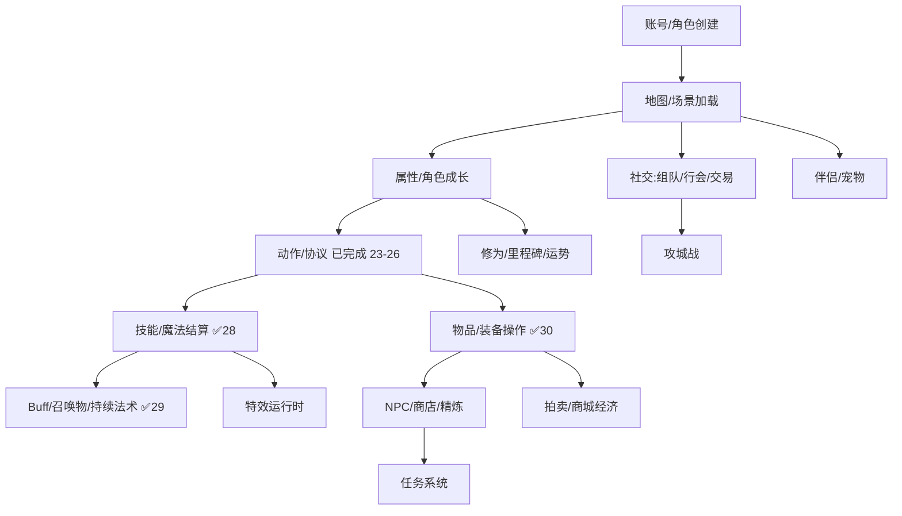
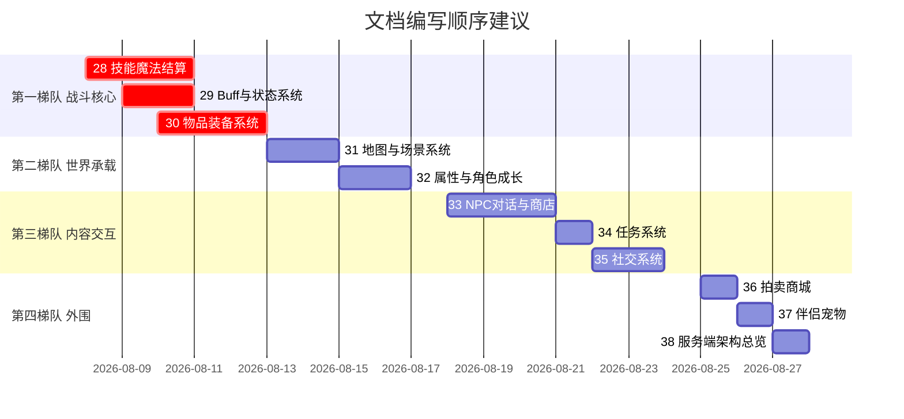

# 27 原版流程梳理计划与任务清单

> 本篇是**规划文档**,不改代码。目的是把 Zircon 原版(`Client/` + `ServerLibrary/` + `LibraryCore/`)各子系统按"源码实测 + 行号 + 全清单 + 链路图 + 双向映射表"的标准逐份梳理,作为 Godot 移植与后续开发的查阅地基。
>
> 已完成的 23-30 覆盖了**动作层 + 协议层 + 效果层(技能/Buff)+ 数据层(物品)**;本清单列出其余**未梳理子系统**的详细任务,按优先级排序。

---

## 一、已完成盘点(23-30)

| 编号 | 标题 | 覆盖内容 | 篇幅 |
|---|---|---|---|
| 23 | 人物动作系统 | 输入→AttemptAction→C.\*→服务端校验→S.\*广播→ActionQueue→SetAnimation 全链路;MirAction/MirAnimation 枚举;GetAttackAnimation/GetMagicAnimation 动画表;时间常量表 | 17KB |
| 24 | 怪物动作与魔法 | AI int→136 行为工厂;施法四件套(AttackMagic/AttackAoE/LineAoE);38 种怪物魔法全列表;动画/特效/弹道映射;40+ 特殊 AI 模板 | 15KB |
| 25 | 通信协议 | MessageID=类型排序索引机制;153 C.\* + 216 S.\* 全清单(14 分组);4 条端到端链路;[CompleteObject]/ObserverPacket 机制 | 16KB |
| 26 | UI/快捷键与交互动作 | KeyBindAction 枚举(窗口 24+模式 9+腰带 10+技能 28);OnKeyDown 分发;鼠标交互(Shift 强攻/Alt 钓鱼驯马采集/挖矿);AutoPath;钓鱼/驯马状态机 | 8KB |
| 28 | 技能魔法系统 | 190 技能文件全清单;MagicObject 基类 24+ 虚方法;服务端十步施法链路;客户端 UseMagic 四 switch;20 代表技能剖析;AttackSkill 挂钩链;学习/升级/冷却 | 40.8KB |
| 29 | Buff 与状态系统 | BuffType 64 全表;BuffInfo 生命周期;双通道协议;SpellObject 12 持续法术;CreateMagicEffect 29 特效映射;PoisonType 16 毒全链 | 19.8KB |
| 30 | 物品装备系统 | ItemInfo 字段全表;ItemType 38 类;22 装备槽+49 格类型;UserItem 实例模型;18+18 协议包;货币/宝箱/礼包/自动药水/腰带;UI 汇总 | 20.9KB |

**七份合起来回答的问题**:玩家/怪物做了什么动作 → 怎么编码成包 → 怎么传 → 服务端怎么校验 → 怎么广播 → 客户端怎么播动画。

**还没回答的问题**:动作产生的**效果**已由 28-29 覆盖(技能结算/召唤/Buff/持续法术/毒);动作操作的**数据**(物品/装备/属性)已由 30 覆盖;剩余:动作所在的**世界**(地图/区域/副本)怎么承载;动作的**内容**(NPC/任务/社交)怎么交互。

---

## 二、缺口分析:按客户端完整流程

### 子系统规模数据(实测)

| 子系统 | 关键源码 | 规模 | 覆盖 |
|---|---|---|---|
| 技能/魔法结算 | `ServerLibrary/Models/Magics/{Wizard,Warrior,Taoist,Assassin}/` | **190 文件**(46/37/51/56);`MagicObject.cs` 基类 24 虚方法;`MagicCast` 返回类 | ✅ 28 |
| Buff/状态 | `BuffType` 64 种(Enum.cs:231);`BuffInfo` 12 字段;`SpellObject` **12 种持续法术(实测,非预估 15)**;`CreateMagicEffect` 29 特效 | 中 | ✅ 29 |
| 物品/装备 | `ItemInfo` 497 行 30+ 字段;1078 物品类型;`EquipmentSlot` 22 槽;`UserItem` 24KB;`CharacterDialog` 3683 行;`InventoryDialog` 730 行 | 大 | ✅ 30 |
| 地图/场景 | `MapInfo` 30+ 字段;244 地图;`Map.cs`;MapRegion/SafeZone/Instance/Movement;天气 4 类;光照 | 中 | ⚠️ 06 仅渲染 |
| 属性/成长 | `Stat.cs` 931 行(153 个 Stat 枚举);`BaseStat`;Hermit;修为/里程碑/运势 | 中 | ❌ |
| NPC/任务 | `NPCDialog.cs` **8496 行**;`NPCInfo.cs` 1093 行(脚本系统 NPCPage/NPCCheck/NPCAction/NPCButton/NPCGood/NPCType/NPCRequirement/NPCValue);`QuestDialog` 2803 行 | **超大** | ❌ |
| 社交 | `GuildDialog` 3308 行;组队/交易/邮件/婚姻 | 中 | ❌ |
| 攻城 | `ConquestWar.cs`;Castle 5 表(CastleInfo/Flag/Gate/Guard) | 小 | ❌ |
| 经济 | 拍卖行/商城;`GameStoreDialog` 1235 行 | 中 | ❌ |
| 伴侣/宠物 | `CompanionDialog` 1478 行;Companion 5 表 | 小 | ❌ |
| 服务端架构 | `PlayerObject.cs` **17829 行**;`SEnvir.cs`;`SConnection.cs` | 超大 | ⚠️ 23-26 零散 |

---

## 三、任务清单详表(编号 28-36)

### 编写规范(沿用 23-26 标准)

- **源码实测**:所有行号经 grep/read 二次核对,写入后校验
- **全清单**:枚举/文件/字段/包名尽量穷举,带文件:行号
- **链路图**:输入→处理→发包→广播→收包→渲染的端到端流程
- **双向映射表**:C.\*↔S.\* 对应、客户端↔服务端职责对照
- **不写移植代码**:只梳理原版"是什么、怎么跑",移植方案见 15

---

### ★★★ 第一梯队:战斗核心(M6/M9/M10 地基)

---

#### 任务 28:技能魔法系统——四职业技能树与服务端结算全链路

**状态**:✅ 已完成 → `docs/notes/28-技能魔法系统.md`(40.8KB,远超预估 20-25KB) | **优先级**:★★★ 最高 | **依赖**:无(23 已覆盖客户端施法入口) | **预计**:大(190 文件)

**理由**:战斗是 MMORPG 核心。23 只写了客户端"怎么发 `C.Magic`",没写服务端"怎么结算伤害/召唤/位移/Buff"。190 个技能实现文件是全库最密集的代码块,不梳理则 M10 战斗特效完善只能边读边猜。

**源码范围**:
- `LibraryCore/SystemModels/MagicInfo.cs`——MagicInfo 字段(Name/Magic/Class/等级需求/MP/冷却/技能图标/描述)
- `LibraryCore/Enum.cs:628`——MagicType 枚举(玩家技能 100-458)
- `ServerLibrary/Models/MagicObject.cs`——抽象基类,24 个虚方法(MagicCast/MagicComplete/MagicConsume/MagicFinalise/Process/AttackCast/AttackLocationSuccess/SecondaryAttackLocation/LifeSteal/AttackComplete/ModifyPowerAdditionner/ModifyPowerMultiplier/GetPassiveStats/GetElement 等);`MagicCast` 返回类(Locations/Targets/Ob)
- `ServerLibrary/Models/Magics/Wizard/` 46 文件、`/Warrior/` 37、`/Taoist/` 51、`/Assassin/` 56——每个技能一个类
- `ServerLibrary/Models/PlayerObject.cs:14731` `Magic(C.Magic)`——服务端技能分派入口
- `Client/Scenes/GameScene.cs:2926` `UseMagic(SpellKey)`——客户端施法入口(23 已部分覆盖)
- 协议:`C.Magic` / `S.ObjectMagic` / `S.NewMagic` / `S.MagicLeveled` / `S.MagicCooldown` / `S.MagicToggle`

**内容大纲**:
1. MagicInfo/MagicType 结构与四职业技能树全清单(190 文件分组表:技能名/Class/等级/MP/冷却/效果类型)
2. MagicObject 基类生命周期:MagicCast(施放)→MagicComplete(动画完成)→MagicConsume(消耗)→MagicFinalise(收尾);AttackCast/AttackLocationSuccess(攻击技能挂钩)
3. 服务端结算流程:`PlayerObject.Magic` → 按 MagicType 反射到 MagicObject 子类 → MagicCast 返回 Targets/Locations → Broadcast `S.ObjectMagic` → DelayedAction 结算
4. 四职业代表技能深度剖析(每职业选 3-5 个):Wizard(FireBall/FireWall/ChainLightning/ElementalHurricane)、Warrior(Slaying/HalfMoon/BladeStorm/CrushingWave)、Taoist(Heal/SummonSkeleton/TrapOctagon/PoisonousCloud)、Assassin(Cloak/DanceOfSwallow/FlashOfLight/Chain)
5. 客户端 UseMagic 100+ case 与服务端结算的对应表
6. 技能学习/升级/经验/冷却包链路(`NewMagic`/`MagicLeveled`/`MagicCooldown`/`MagicToggle`)
7. 强化技能/潜能/阵法(EI2.0 特有,对照 22 号文档)
8. 攻击技能被动挂钩(AttackCast→SecondaryAttackLocation→AttackCompletePassive,对应 23 §5.1 客户端 CanPowerAttack/CanThrusting 链)

**验收标准**:
- 190 技能文件全部分组列表(含 Class/等级/效果分类)
- MagicObject 基类 24 虚方法各自职责说明
- 至少 12 个代表技能的"客户端 UseMagic case → 服务端 MagicCast → S.ObjectMagic 字段 → DelayedAction 结算"完整链路
- 技能学习/升级/冷却的全包链路图

---

#### 任务 29:Buff 与状态系统——64 种 Buff 与 12 种持续法术(实测)

**状态**:✅ 已完成 → `docs/notes/29-Buff与状态系统.md`(19.8KB) | **优先级**:★★★ 最高 | **依赖**:28(技能侧 Buff 来源) | **预计**:中

**理由**:Buff 是战斗与养成的交叉点。`CreateMagicEffect` 29 项特效、`SpellObject` 12 种持续法术(火墙/毒云/暴风/陷阱,实测),M6 特效运行时和 M10 都需要这张映射表。23/24 反复引用 BuffType 但未展开。

**源码范围**:
- `LibraryCore/Enum.cs:231` `public enum BuffType`——64 种
- `ServerLibrary/DBModels/BuffInfo.cs`——BuffInfo 11 字段(Type/Stats/RemainingTime/TickFrequency/TickTime/ItemIndex/Visible/Pause/Hidden/Extra)
- `ServerLibrary/Models/MapObject.cs`——Buff 生命周期(Add/Remove/Process Tick/Pause)
- `Client/Models/MapObject.cs:5657-6101` `CreateMagicEffect`——29 项 MagicEffect 特效映射(28 case)
- `Client/Models/SpellObject.cs`——12 种持续法术(SpellEffect 枚举:FireWall/Tempest/IceAura/TrapOctagon/PoisonousCloud/DarkSoulPrison/BurningFire/Rubble/SafeZone/ZombieHole 等)
- `LibraryCore/Enum.cs` PoisonType——中毒状态
- 协议:`S.BuffAdd` / `S.BuffRemove` / `S.BuffChanged` / `S.BuffTime` / `S.BuffPaused` / `S.ObjectBuffAdd` / `S.ObjectBuffRemove` / `S.ObjectPoison` / `S.ObjectSpell` / `S.ObjectSpellChanged`

**内容大纲**:
1. BuffType 64 种全清单(效果描述/来源技能或物品/持续时间/Stats 修改/是否可见/是否可暂停)
2. BuffInfo 生命周期:服务端 Add→Tick(TickFrequency)→Remove/Expire;Pause 机制;Hidden 机制
3. Buff 协议链路:`S.BuffAdd/Remove/Changed/Time/Paused`(自身)+ `S.ObjectBuffAdd/Remove`(广播外观)
4. 持续法术 SpellEffect 全表(12 种,实测):各配图库/帧表/混合率/光照/循环音效/锚定方式(Floor/Object)
5. PoisonType 中毒系统(绿毒/红毒/麻痹/恐惧/沉默/定身/Neutralize 等)与外观
6. 客户端 CreateMagicEffect 特效映射表(BuffType→MirEffect 图库/帧/混合/光晕)
7. Buff 与技能/物品的来源关系(哪些技能加 Buff、哪些装备/消耗品加 Buff)

**验收标准**:
- BuffType 64 种全表(含来源/Stats/可见性)
- SpellEffect 12 种持续法术各配图库/帧表/混合参数
- PoisonType 全表与外观映射
- Buff 协议链路图(自身 vs 广播双通道)

---

#### 任务 30:物品装备系统——1078 物品全链路与 22 装备槽

**状态**:✅ 已完成 → `docs/notes/30-物品装备系统.md`(20.9KB) | **优先级**:★★★ 最高 | **依赖**:无 | **预计**:大

**理由**:物品/装备/背包是基础可玩性,M9 移植直接需要。1078 物品类型、稀有度词缀、22 装备槽、精炼/打造/打孔/宝石,是数据量仅次于技能的子系统。

**源码范围**:
- `LibraryCore/SystemModels/ItemInfo.cs` 497 行——ItemInfo 30+ 字段(ItemName/ItemType/RequiredClass/Shape/Effect/ItemEffect/ExteriorEffect/Image/Durability/Price/Weight/StackSize/CanRepair/CanDrop/Description 等)
- `LibraryCore/Enum.cs:89` `EquipmentSlot`——22 槽(Weapon/Armour/Helmet/Torch/Necklace/BraceletL/R/RingL/R/Shoes/Poison/Amulet/Flower/HorseArmour/Emblem/Shield/Costume + 钓鱼 5 槽 Hook/Float/Bait/Finder/Reel)
- `ServerLibrary/DBModels/UserItem.cs` 24KB——UserItem(实例物品/耐久/Stats/词缀/Socket/锁/过期)
- `ServerLibrary/DBModels/UserItemStat.cs` / `UserItemSocket.cs`——物品属性与宝石孔
- `LibraryCore/SystemModels/SetInfo.cs` / `ItemInfoStat.cs`——套装系统
- `Client/Scenes/Views/InventoryDialog.cs` 730 行 / `CharacterDialog.cs` 3683 行 / `StorageDialog.cs` 546 行 / `BeltDialog.cs` / `FilterDropDialog.cs`
- `Client/Models/ItemObject.cs`——地面物品(稀有度光效/Currency 图/DrawFocus)
- 协议:`C.ItemMove/Sort/Delete/Split/Drop/Use/Lock` / `C.BeltLinkChanged` / `C.AutoPotionLinkChanged` / `C.PickUp` / `C.LootBox*` / `C.Bundle*` + 对应 `S.*`(见 25 §3.6)

**内容大纲**:
1. ItemInfo 结构详解(30+ 字段)与 ItemType 分类
2. 1078 物品类型分组总表(沿用 22 Part 3 的 Book 173/Weapon 124/Consumable 118/Armour 104/Ring 100/Necklace 92/Bracelet 86/Helmet 32/Shoes 21/DarkStone 20)
3. 22 装备槽与外观映射(每槽对应图集/LibraryWeaponShape/ExteriorEffect)
4. 稀有度与词缀系统(Rarity/词缀 Stats/套装 SetInfo)
5. 物品操作全链路:移动/合并/拆分/锁定/使用/丢弃 → C.\*/S.\* 包对应表
6. 背包/装备/仓库/腰带 UI 结构(InventoryDialog/CharacterDialog/StorageDialog/BeltDialog)
7. 地面物品:稀有度光效(Common/词缀蓝光/Superior绿/Elite紫)/Currency 图/拾取
8. 货币系统(CurrencyInfo/UserCurrency)
9. 战利品箱/礼包(LootBox/Bundle 机制)
10. 精炼/打造/打孔/宝石合成(NPC 侧,协议见 25 §2.5,详细脚本见任务 32)
11. 自动药水(AutoPotionLink HP/MP 阈值)
12. 物品属性计算(ItemStat/Stats 叠加/元素亲和)

**验收标准**:
- ItemInfo 30+ 字段表
- 22 装备槽与外观映射表
- 物品操作 C.\*↔S.\* 全对应表
- 稀有度光效 4 档映射
- 套装系统结构

---

### ★★ 第二梯队:世界承载(M11-M14 地基)

---

#### 任务 31:地图与场景系统——244 地图与区域/副本/昼夜/天气

**优先级**:★★ 高 | **依赖**:无 | **预计**:中

**理由**:地图是所有玩法的容器。06 只写了 Zl 图库与 .map 读取渲染,没写逻辑层(区域/安全区/副本/传送/天气/光照/矿点/钓鱼点)。

**源码范围**:
- `LibraryCore/SystemModels/MapInfo.cs`——30+ 字段(FileName/Description/MiniMap/Light/Weather/Fight/AllowRT/SkillDelay/CanHorse/CanAutoPath/CanMine/CanMarriageRecall/MinimumLevel/MaximumLevel/ReconnectMap/Music/Background/MonsterHealth/MonsterDamage/DropRate 等)
- `LibraryCore/SystemModels/MapRegion.cs` / `SafeZoneInfo.cs` / `InstanceInfo.cs` / `MovementInfo.cs` / `MineInfo.cs` / `FishingInfo.cs` / `RespawnInfo.cs` / `GuardInfo.cs`
- `ServerLibrary/Models/Map.cs` 25KB——地图实例化与对象管理
- `Client/Scenes/Views/MapControl.cs`(23/26 已覆盖输入,这里聚焦地图逻辑)
- `Client/Models/Particles/Weather/` Fog/Lightning/Rain/Snow
- 协议:`S.MapChanged` / `S.DayChanged` / `S.TimeOfDayChanged` / `S.SafeZoneChanged` / `S.DataObject*`(7 个小地图数据包)/ `C.AutoPath*` / `C.TeleportRing`

**内容大纲**:
1. MapInfo 30+ 字段详解与 244 地图全表(沿用 22 Part 2 分组:真天宫/黑宫/幽灵船/诺马/西沙/冰封/龙渊)
2. Map.cs 实例化:对象管理(玩家/怪物/NPC/物品进出视野)、碰撞、广播范围
3. MapRegion 区域类型(安全区/钓鱼区/矿点/竞技场/攻城区)与 SafeZoneInfo
4. InstanceInfo 副本系统(单人/组队/进入条件/重置)
5. MovementInfo 传送点(目标地图/坐标/条件)
6. 昼夜循环(DayChanged/TimeOfDayChanged)与 LightSetting
7. 天气系统(Weather: Fog/Lightning/Rain/Snow 4 类,客户端粒子)
8. 矿点 MineInfo / 钓鱼点 FishingInfo(对照 26 的挖矿/钓鱼状态机)
9. 视野管理与对象进出范围:`S.ObjectPlayer/Monster/NPC/Item`(进) + `S.ObjectRemove`(出) + `S.DataObject*`(小地图/好友视野)
10. RespawnInfo 怪物刷新 / GuardInfo 城卫

**验收标准**:
- MapInfo 30+ 字段表
- 244 地图分组(沿用 22)+ 各地图属性(光照/天气/等级限制/可骑马/可挖矿等)
- 区域类型全表
- 对象进出视野协议链路
- 副本/传送/昼夜/天气各成节

---

#### 任务 32:属性与角色成长——Stat 系统与升级/修为/里程碑

**优先级**:★★ 高 | **依赖**:无 | **预计**:中

**理由**:角色养成基础。`Stat.cs` 931 行(153 个 Stat 枚举)、BaseStat、HermitPoints、修为/里程碑/运势,是所有数值计算的根。

**源码范围**:
- `LibraryCore/Stat.cs` 931 行——`Stat` 枚举 153 个(Enum.cs:507-895)+ StatSource/StatType 枚举 + Stats 容器
- `LibraryCore/SystemModels/BaseStat.cs`——职业/等级基础属性
- `ServerLibrary/Models/PlayerObject.cs`——升级/经验/属性计算/Hermit 加点
- `ServerLibrary/DBModels/UserDiscipline.cs` / `UserMilestone.cs` / `UserFortuneInfo.cs`
- `Client/Scenes/Views/MainPanel.cs` 820 行——HUD 数值显示(DC/MC/SC/AC/MAC/FP/CP)
- 协议:`S.StatsUpdate` / `S.LevelChanged` / `S.InformMaxExperience` / `S.GainedExperience` / `C.Hermit` / `S.DisciplineUpdate` / `S.DisciplineExperienceChanged` / `S.UserMilestones` / `S.MilestoneEarned` / `S.FortuneUpdate` / `C.FortuneCheck`

**内容大纲**:
1. Stat 枚举 153 个全清单(按类别:基础 HP/MP/FP/CP、攻击 DC/MC/SC、防御 AC/MAC、攻速/幸运/暴击、元素亲和 Fire/Ice/Lightning/Wind/Holy/Dark/Phantom、负重、抗性等)
2. Stats 容器与计算(叠加/百分比/基础值)
3. BaseStat——职业 × 等级的基础属性表
4. 升级/经验链路(LevelChanged/InformMaxExperience/GainedExperience)
5. Hermit 隐士加点(C.Hermit → StatsUpdate)
6. 修为系统(Discipline:提升/经验/属性加成)
7. 里程碑系统(Milestone:达成/激活/领取奖励)
8. 运势系统(Fortune:查运势/物品绑定)
9. 外观定制(性别/发型/发色/铠甲色/称号/名字 → C.GenderChange/HairChange/ArmourDye/NameChange/CaptionChange)
10. MainPanel HUD 数值显示逻辑

**验收标准**:
- Stat 153 枚举全表(分类)
- BaseStat 职业 × 等级基础值说明
- 升级/修为/里程碑/运势各协议链路
- 外观定制 C.\*↔S.\* 对应

---

### ★ 第三梯队:内容交互(M13-M15)

---

#### 任务 33:NPC 对话与商店脚本系统

**优先级**:★ 中 | **依赖**:30(物品) | **预计**:超大(8496 行)

**理由**:`NPCDialog.cs` 8496 行是最大 UI 文件,`NPCInfo.cs` 1093 行定义了一套完整脚本式对话系统(NPCPage/NPCCheck/NPCAction/NPCButton/NPCGood/NPCType/NPCRequirement/NPCValue),内容量巨大但可后置到 M14。

**源码范围**:
- `LibraryCore/SystemModels/NPCInfo.cs` 1093 行——NPCInfo / NPCPage / NPCGood / NPCType / NPCCheck / NPCAction / NPCButton / NPCRequirement / NPCValue 8 个类
- `ServerLibrary/Models/NPCObject.cs` 34KB——NPC 脚本执行引擎
- `Client/Scenes/Views/NPCDialog.cs` 8496 行——13 子对话框(买/卖/银/换/炼/锻/租房/租船/租鱼/银行/保险/租赁/维修)
- `Client/Scenes/Views/NPCSocketDialog.cs` / `NPCSocketCombineDialog.cs`——打孔/宝石合成
- 协议:`C.NPCCall/Button/Buy/Sell/Fragment/Repair/Refine/MasterRefine/RefinementStone/AccessoryLevelUp/AccessoryUpgrade/AccessoryRefine/WeaponCraft/SocketItem/SocketCombine/RefineRetrieve/Roll` + `S.NPCResponse/Close/Roll/Repair/Refine*/Accessory*/WeaponCraft/Socket*`(见 25 §2.5/§3.7)

**内容大纲**:
1. NPCInfo/NPCPage 脚本结构(对话页/按钮/检查/动作/需求/变量/Say 模板)
2. NPCCheck 条件系统(等级/职业/物品/货币/变量/运气)
3. NPCAction 动作系统(给物品/扣货币/改变量/传送/触发任务)
4. 商店系统(NPCGood 买/卖/碎片/SellRate)
5. 精炼系统全链路(普通精炼 NPCRefine / 大师精炼 NPCMasterRefine / 精炼石 NPCRefinementStone / 取回 NPCRefineRetrieve)
6. 打造系统(NPCWeaponCraft:7 宝石槽;NPCAccessoryUpgrade/LevelUp/Refine/Reset)
7. 打孔与宝石合成(NPCSocketItem / NPCSocketCombine)
8. 修理(NPCRepair 普通/特殊)
9. NPC 掷骰(NPCRoll:概率判定)
10. 客户端 NPCDialog 13 子对话框结构与切换

**验收标准**:
- NPCPage 脚本 8 类(NPCPage/NPCCheck/NPCAction/NPCButton/NPCGood/NPCType/NPCRequirement/NPCValue)字段全表
- 精炼/打造/打孔/宝石合成各协议链路
- 13 子对话框结构索引

---

#### 任务 34:任务系统全链路

**优先级**:★ 中 | **依赖**:33(NPC) | **预计**:中

**理由**:QuestInfo/UserQuest,接受/完成/追踪/放弃,QuestDialog 2803 行。M14 移植需要。

**源码范围**:
- `LibraryCore/SystemModels/QuestInfo.cs`
- `ServerLibrary/DBModels/UserQuest.cs` 5.9KB
- `ServerLibrary/Models/PlayerObject.cs`——任务进度处理
- `Client/Scenes/Views/QuestDialog.cs` 2803 行 / `QuestTrackerDialog.cs`
- 协议:`C.QuestAccept/Complete/Track/Abandon` + `S.QuestChanged/QuestCancelled`

**内容大纲**:
1. QuestInfo 结构(任务类型/需求/奖励/前置/NPC 绑定)
2. UserQuest 进度跟踪(击杀/采集/对话/物品)
3. 接受/完成/追踪/放弃包链路
4. QuestDialog UI 与 QuestTracker 追踪显示
5. 任务奖励(经验/物品/货币/选择奖励)

**验收标准**:
- QuestInfo 字段表
- 任务全生命周期协议链路
- 任务类型分类

---

#### 任务 35:社交系统——组队/行会/交易/邮件/婚姻

**优先级**:★ 中 | **依赖**:无 | **预计**:中

**理由**:社交是 MMORPG 留存核心,GuildDialog 3308 行,组队/交易/邮件/婚姻各有协议。

**源码范围**:
- `LibraryCore/SystemModels/` 相关(无独立 GroupInfo,组队靠 SEnvir 内存)
- `ServerLibrary/DBModels/GuildInfo.cs` 9.6KB / `GuildMemberInfo.cs` / `GuildWarInfo.cs`
- `ServerLibrary/DBModels/MailInfo.cs` / `FriendInfo.cs` / `BlockInfo.cs`
- `Client/Scenes/Views/GuildDialog.cs` 3308 行 / `GroupDialog.cs` / `TradeDialog.cs` / `CommunicationDialog.cs`(聊天)64.8KB
- `ServerLibrary/Models/ConquestWar.cs`——攻城战
- 协议:`C/S.Group*`(7+7)/ `C/S.Guild*`(17+29)/ `C/S.Trade*`(6+8)/ `C/S.Mail*`(邮件)/ `C/S.Marriage*`(3+5)/ `C/S.Friend*`/`Block*`

**内容大纲**:
1. 组队(Group:邀请/申请/允许开关/LFG 招募/成员管理)
2. 行会(GuildInfo:成员/资金/等级/税/颜色/旗帜/权限/公告;创建/编辑/踢人/扩容)
3. 行会战与攻城(GuildWar/ConquestWar:宣战/攻城日期/城堡归属/城门/守卫;CastleInfo/Flag/Gate/Guard)
4. 交易(TradeRequest/Open/AddItem/AddGold/Confirm/Unlock 双方确认机制)
5. 邮件(MailInfo:发送/附件/列表/删除;C.MailSend/Opened/GetItem/Delete)
6. 聊天系统(Chat:MessageType 普通/喊话/私聊/行会/系统;LinkedItems;CommunicationDialog 64.8KB)
7. 婚姻(Marriage:邀请/婚戒/传送/上下线通知)
8. 好友/黑名单(FriendUpdate/Add/Remove;BlockAdd/Remove)

**验收标准**:
- 各社交子系统协议链路
- GuildInfo/GuildMemberInfo 权限模型
- 交易双方确认状态机
- 攻城战流程

---

### ○ 第四梯队:外围/经济(按需)

---

#### 任务 36:拍卖行与商城经济系统

**优先级**:○ 低 | **依赖**:30(物品) | **预计**:中

**理由**:拍卖行/商城是经济外围,可按需梳理。

**源码范围**:
- `ServerLibrary/DBModels/AuctionInfo.cs` / `AuctionHistoryInfo.cs` / `GameStoreSale.cs` / `GameStoreFavourite.cs` / `GameGoldPayment.cs`
- `Client/Scenes/Views/GameStoreDialog.cs` 1235 行 / `ConsignmentDialog.cs`(寄售)58KB
- 协议:`C/S.MarketPlace*`(寄售/搜索/购买/历史/取消)/ `C/S.GameStore*`(直购/赠送/收藏)

**内容大纲**:MarketPlace 寄售/搜索/购买/历史;GameStore 直购/赠送/收藏;游戏金币充值;货币流向。

---

#### 任务 37:伴侣与宠物养成系统

**优先级**:○ 低 | **依赖**:24(怪物 AI 的宠物分支) | **预计**:小

**理由**:Companion 5 表,伴侣养成与宠物模式,内容量小。

**源码范围**:
- `LibraryCore/SystemModels/CompanionInfo.cs` / `CompanionLevelInfo.cs` / `CompanionSkillInfo.cs` / `CompanionSpeech.cs`
- `ServerLibrary/DBModels/UserCompanion.cs` / `UserCompanionUnlock.cs` / `CompanionFilters.cs`
- `ServerLibrary/Models/Monsters/Companion.cs`——宠物 AI(ObjectIdle 表演)
- `Client/Scenes/Views/CompanionDialog.cs` 1478 行
- 协议:`C/S.Companion*`(解锁/收养/取出/释放/存入/筛选/更新)+ `S.ObjectPetOwnerChanged`/`ObjectIdle`

**内容大纲**:Companion 解锁/收养/养成(等级/经验/饱食/技能);宠物模式 PetMode;宠物归属;ObjectIdle 表演。

---

#### 任务 38:服务端架构总览

**优先级**:○ 低 | **依赖**:23-26(已覆盖动作/协议)+ 28-31(技能/物品/地图) | **预计**:中

**理由**:`PlayerObject.cs` 17829 行是全库最大文件,`SEnvir.cs` 是服务端主循环。23-26 零散引用,建议最后做一份"地图式"索引。

**源码范围**:
- `ServerLibrary/Envir/SEnvir.cs`——主循环/世界 Tick/广播/账号/选角
- `ServerLibrary/Envir/SConnection.cs`——连接管理(152 C.\* 处理器,25 已覆盖)
- `ServerLibrary/Models/PlayerObject.cs` 17829 行——按功能区索引(动作 23/魔法 28/物品 30/社交 35/任务 34 各对应哪些行段)
- `ServerLibrary/Envir/EmailService.cs` / `WebServer.cs`

**内容大纲**:SEnvir 主循环;SConnection 连接生命周期;PlayerObject 17829 行分区索引(按已梳理子系统交叉引用);定时器/事件系统;邮件/Web 服务。

**验收标准**:PlayerObject 17829 行按功能分区索引表(每区对应行号范围 + 已梳理文档编号)。

---

## 四、优先级与建议执行顺序

### 强烈建议立刻做(第一梯队 28/29/30)

**理由**:
1. **战斗闭环**:23-26 建立了"动作→协议"框架,28-30 补上"动作→效果"和"动作→数据",三者合起来才是完整战斗闭环。当前只回答了"怎么打",没回答"打了有什么效果、掉什么东西、加什么 Buff"。
2. **M6/M9/M10 地基**:这三个里程碑(特效运行时/物品系统/战斗特效)是移植主线,文档梳理的直接消费者。
3. **数据密度最高**:190 技能文件 + 1078 物品 + 64 Buff 是原版最密集的"数据表",不梳理就只能边读边猜,极易出错。
4. **可并行**:28(技能结算)与 30(物品)无依赖,可同时调研;29(Buff)依赖 28 但可紧跟。

### 次之(第二梯队 31/32)

地图与属性是所有系统的承载层,M11-M14 都会用到。31 可与第一梯队并行(无依赖)。

### 按里程碑进度做(第三梯队 33-35)

做到 M14(NPC/任务)时再梳理 33/34;做到 M15(社交)时再梳理 35。

### 最后做(第四梯队 36-38)

外围经济与宠物按需;38(服务端架构总览)建议最后做,作为全部梳理完成后的"总索引"。

---

## 五、文档规模预估

| 编号 | 标题 | 预计篇幅 | 源码量 | 实际 |
|---|---|---|---|---|
| 28 | 技能魔法系统 | 20-25KB | 190 文件 + 基类 | ✅ 40.8KB |
| 29 | Buff与状态系统 | 12-15KB | 64 Buff + 12 法术(实测) | ✅ 19.8KB |
| 30 | 物品装备系统 | 18-22KB | 1078 物品 + 22 槽 | ✅ 20.9KB |
| 31 | 地图与场景系统 | 15-18KB | 244 地图 + 区域 |
| 32 | 属性与角色成长 | 12-15KB | 153 Stat + 修为 |
| 33 | NPC对话与商店 | 18-22KB | 8496 行 + 脚本系统 |
| 34 | 任务系统 | 8-10KB | QuestInfo + 2803 行 |
| 35 | 社交系统 | 15-18KB | 行会/交易/邮件/婚姻 |
| 36 | 拍卖商城 | 8-10KB | MarketPlace/GameStore |
| 37 | 伴侣宠物 | 6-8KB | Companion 5 表 |
| 38 | 服务端架构总览 | 10-12KB | PlayerObject 17829 行索引 |
| **合计** | | **~160KB** | |

加上已完成 23-26 的 57KB 与 28-30 的 81.6KB,全部完成后将形成约 **300KB 的原版流程梳理知识库**,覆盖 Zircon 客户端+服务端全部主要子系统。

---

## 六、与现有文档的关系

- **22(EI2.0 资料)**:提供游戏内容背景(地图/装备/技能阶段),28/30 直接引用其分组表
- **23-26(动作/协议)**:28-30 是其"效果层"和"数据层"补充
- **15(完全移植计划)**:28-38 为其 M6-M15 各里程碑提供"原版参考"细节,15 是"怎么移",28-38 是"原版是什么"
- **06(地图渲染)**:31 补充其逻辑层

**执行原则**:每完成一份,在本清单对应任务标记 `[x]` 并补实际篇幅;编号延续 `docs/notes/` 序列。